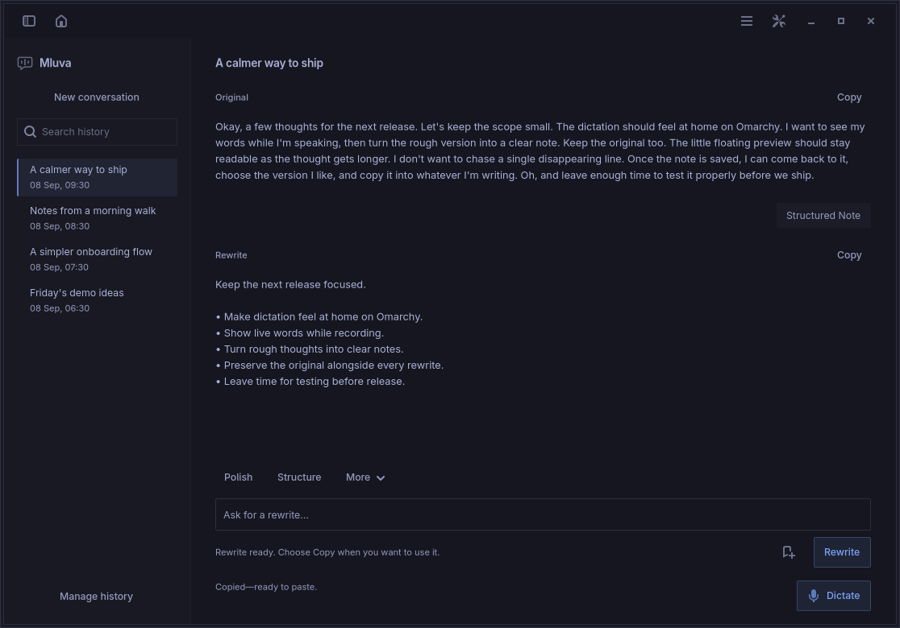

**The most delightful dictation app for Omarchy.**

Speak a rough idea. Shape it into useful text. Keep the original. Mluva brings dictation, rewriting and searchable history into a native workspace that follows your Omarchy theme. Paste existing text to polish it, or enable **Live rewrite** to build a task spec or structured note while you speak.

**[Install on Linux](linux/README.md#supported-desktop-contract)** · **[Omarchy plugin](https://github.com/1vecera/omarchy-mluva)** · **[Watch the 55-second film](docs/promotion/assets/delight/mluva-delight-launch.mp4)** · **[Features and limits](docs/feature-story.md)** · **[Contribute](#development)**



<sub>Recorded on Omarchy with the Nord palette. Capture versions, provider recordings and the example-text feature walkthrough are distinguished in the <a href="docs/promotion/README.md">media kit and provenance</a>.</sub>

## From a thought to a finished draft

| You want to… | Mluva gives you… |
| --- | --- |
| Get an idea down quickly | F9 dictation and a completed result on the clipboard; Scribe streams words as you speak. |
| Polish text you already have | Paste it into a new conversation, then use **Polish**, **Structure** or your own instruction. |
| Make sense of a long note | **Structure** creates a summary and organized points. |
| Keep your own voice | Editable originals and rewrites, custom instructions, follow-ups and saved prompts. |
| Keep the interface out of your way | Stable Live panes, quiet recording motion, restrained Markdown and a searchable **Ctrl+P** command panel. |
| See what is missing while speaking | **Live rewrite** fills a task spec, structured note or custom template with editable drafts. |
| Find it later | Automatic conversation titles and search across originals, rewrites and instructions. |
| Take the result elsewhere | Copy the text, or export a saved conversation from History as Markdown or JSON. |
| Choose where processing happens | Select speech and rewrite providers independently, including local Whisper and compatible API deployments. |

Live rewrite is opt-in and Experimental. Stop reconciles the provisional draft with the committed transcript before a successful final rewrite can copy automatically. Delight is our design direction; see the [source-backed feature guide](docs/feature-story.md) for behavior and acceptance limits.

On **Omarchy**, a translucent widget shows five lines while you speak, easing upward as the current line fills. When you finish, rewrite directly from the widget. Hovering, keyboard focus, menus and active rewrites pause its four-second default dismissal. **Open** expands the note into the editable workspace; **Shift+F9** reopens the latest conversation when configured.


After installing and starting Mluva, add the [community plugin](https://github.com/1vecera/omarchy-mluva) on Omarchy Quattro:

```sh
omarchy plugin add https://github.com/1vecera/omarchy-mluva.git --enable
```

The [integration guide](docs/omarchy-integration.md) covers dependencies, existing manual installs and removal. [Videos, screenshots and launch copy](docs/promotion/README.md) include their source audio and capture provenance. The integration remains Experimental.

Closing the main window keeps Mluva available. Open the shell menu or application menu to quit.

## Try it on Linux

Install the [Linux dependencies](linux/README.md#supported-desktop-contract), choose a [speech and rewrite provider](docs/provider-selection.md), and provide any required credentials through your secret manager. The defaults are ElevenLabs Scribe and an authenticated Codex app-server. Local Voxtype/Whisper needs an installed model; compatible APIs need separately configured transcription and chat deployments. Then:

```bash
git clone https://github.com/1vecera/Mluva.git mluva
cd mluva
make linux-install
mluva
```

The installer installs for your user. Dictation copies completed text automatically. **Ctrl+P** opens searchable actions; **Ctrl+Enter** sends a custom rewrite. Completed rewrites copy automatically too. Edit either document directly, then Save or press Ctrl+S. Markdown output uses subtle headings and emphasis; focusing it reveals the source for editing, and Copy/Save retain the formatting. Change copying and icon visibility in Settings → Workspace. See the [Linux guide](linux/README.md) for microphone selection, language, shortcuts, saved styles and recovery.

## Where things stand

Mluva is an early open-source project. The status is specific to each capability:

| Platform | Current boundary |
| --- | --- |
| Fedora 44 · GNOME 50 · Wayland | Recording, transcription, recording setup, History and custom saved styles have been manually accepted. |
| Omarchy · Hyprland · Quickshell | Theme integration, streaming review controls and the compact workspace are implemented and tested in isolation; live desktop acceptance remains pending. |
| macOS 14+ | Swift source preview with Apple Speech and Google Cloud recognition. No current signed, notarized public binary. |

Conversation rewriting, generated titles, Meeting mode and other advanced surfaces remain **Experimental**. Automatic insertion is disabled by default and is not yet reliable in the Fedora acceptance setup; the clipboard is the dependable delivery path. The [capability matrix](docs/feature-maturity.md) tracks these boundaries.

## Your text and the cloud

- **Recognition on Linux:** choose cloud ElevenLabs Scribe, local Voxtype/Whisper, or an audio-transcription deployment through a LiteLLM-compatible endpoint.
- **Rewriting and titles:** text goes through your authenticated Codex app-server or configured LiteLLM-compatible endpoint; the selected provider determines where inference runs. Automatic titles use up to 6,000 characters from each new conversation; disable them in Settings to keep local text labels. Existing history is not sent in bulk.
- **Local history:** originals, completed rewrites and titles stay together in a local SQLite database. You can rename, export or delete them. A manual title takes precedence over an automatic one.
- **Incognito:** Mluva saves neither history nor recovery audio and disables conversation rewriting and generated titles. Recognition still uses your selected speech provider; cancellation cannot recall audio already sent to a cloud service.

Audio retention, recovery, Command previews and other details are documented in the [product contract](docs/product-contract.md) and [Linux guide](linux/README.md).

## Development

Linux uses **Python, GTK 4, Libadwaita and PipeWire**, with a separate QML plugin for Omarchy. macOS uses Swift. No webview is required for the conversation workspace.

Start with the [code map and focused checks](CONTRIBUTING.md#code-map) to find the owner of a feature. `make linux-test-fast` gives quick text/editing feedback; use the complete gates below at handoff.

The [capture and development guide](dev/README.md) describes local checks and reproducible screenshots/videos on a private desktop. Promotion captures use the real Omarchy installation and theme.

```bash
make linux-test linux-shortcut-test
shellcheck linux/*.sh linux/tests/*.sh scripts/*.sh linux/mluva-shell
```

The [workspace contract](docs/conversation-workspace.md) and [Omarchy guide](docs/omarchy-integration.md#verification) describe private-display integration tests, synthetic model subprocesses and the remaining manual checks. See the [UI design notes](docs/ui-design.md) for the decisions behind the layout. For macOS source setup and packaging, see [the macOS guide](docs/macos-development.md).

Bug reports are most useful with the platform, reproduction steps and expected behavior. Keep recordings, transcripts and credentials out of public issues. For larger changes, open an issue first to agree on scope.

Mluva means *speech* or *manner of speaking* in Czech. Pronounced roughly “MLOO-vah.” Released under the **[Apache License 2.0](LICENSE)**; see [third-party notices](THIRD_PARTY_NOTICES.md) and the [changelog](CHANGELOG.md).
