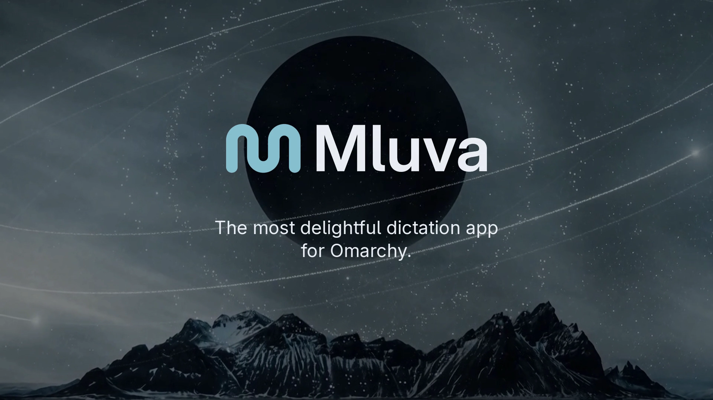
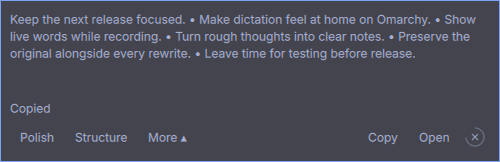

**Native dictation and rewriting for Omarchy.**

Speak freely, turn the result into a useful draft, and keep every original word. Mluva brings recording, editable rewrites and searchable history into a quiet native workspace that follows your desktop theme.

**[Install](#install)** · **[Watch the 55-second film ↗](https://1vecera.github.io/Mluva/#film)** · **[Choose your providers](docs/provider-selection.md)** · **[Release notes](https://github.com/1vecera/Mluva/releases/tag/v1.0.0)**

[](https://1vecera.github.io/Mluva/#film)

<sub>Click the image to open the film with playback controls and captions. Native app footage, synthetic narration and edited timing; see the <a href="docs/promotion/README.md">media guide</a> for credits and demo disclosures.</sub>

## From a thought to a finished draft

| Start with… | Make it useful |
| --- | --- |
| A rough idea | Dictate with F9. Scribe streams words while you speak; completed text copies to the clipboard. |
| Text you already have | Paste into a conversation, then choose **Polish**, **Structure** or your own instruction. |
| A note that needs shape | Enable **Live rewrite** to build a task spec, structured note or custom draft as speech arrives. |
| A draft worth keeping | Edit originals and rewrites, save with **Ctrl+S**, and keep raw recognition available separately. |
| Work to return to | Find conversations through History, reuse saved prompts, and export Markdown or JSON. |

**A calm place to work.** Stable Live panes, restrained recording motion and subtle Markdown keep long notes readable. **Ctrl+P** finds actions; **Ctrl+Enter** sends a rewrite. Copy and scrolling preferences are yours to change.

**Your choice of engines.** Select speech and rewriting independently: ElevenLabs Scribe, local Voxtype/Whisper or a compatible transcription API; native Codex app-server or a LiteLLM/OpenAI-compatible service for rewriting. Availability, credentials and models are configured in Settings.

Live rewrite is opt-in and Experimental. It marks missing information, preserves manual edits and reconciles the draft with the final transcript when recording stops. [Explore the features and their limits →](docs/feature-story.md)

## Install

Run the setup from a source checkout. On **Omarchy Quattro**, it installs the desktop dependencies, native application and shell plugin together. It shows the installation plan first; system packages may request your sudo password.

```sh
git clone --depth 1 https://github.com/1vecera/Mluva.git mluva
cd mluva
bash install.sh
```

Launch **Mluva** from the application menu, then choose your [speech and rewrite providers](docs/provider-selection.md). Cloud providers need an account and credentials; local Whisper needs Voxtype and a downloaded model. Provider setup is separate from installing the app.

### Install with an agent

Copy this prompt into your coding agent:

```text
Install Mluva from https://github.com/1vecera/Mluva on this computer.
Use the repository's install.sh to install desktop dependencies and the native
app, including the mluva.dictation plugin on Omarchy Quattro. Inspect the setup
script, then run it with --yes. Preserve existing settings, conversations and
plugin customizations. If Mluva is running, ask me to quit it before upgrading.
Help me configure speech and rewriting with my chosen providers, installing
any required provider client and using existing credentials without revealing
them. Tell me how to launch Mluva and approve its recording shortcuts.
```

**Other install paths:** `bash install.sh --app-only` installs the native app without changing plugins. Fedora GNOME uses the same setup command, with the compatibility limits below. For a staged install or preinstalled dependencies, see the [Linux guide](linux/README.md#install-for-the-current-user).

**Upgrading:** quit Mluva, update the checkout with `git pull --ff-only`, and rerun `bash install.sh`. Existing plugin customizations are preserved; setup checks for conflicting changes before installing. If a later plugin operation fails, the native app remains installed and setup reports how to retry. Upgrades from 0.x migrate the old product identities and retain a private backup of settings, conversations, drafts and audio. See the [migration guide](docs/identity-migration.md) for customized installations.

### The Omarchy widget

The floating widget starts with five preview lines while you speak. The recording light and timer sit above the text box. Drag the text box or its status badge to move it, or focus it and press **Super+T** on Omarchy to tile it. Floating mode keeps it above other windows; resizing gives the preview more room. The main app keeps the recording light and timer in its title bar. When you finish, rewrite, copy or open the note in the workspace. Hover, keyboard focus and active rewrites pause its configurable four-second dismissal. **Shift+F9** reopens the latest conversation when configured.



Closing the main window keeps Mluva available; quit from the shell or application menu. The [Omarchy guide](docs/omarchy-integration.md) covers dependencies, existing manual installs and removal.

## Platform support

| Platform | Status |
| --- | --- |
| **Omarchy · Hyprland · Quickshell** | **Primary, maintained platform.** The dictation, rewrite and widget workflow is tested end to end and used daily by the maintainer. |
| Fedora · GNOME · Wayland | Compatibility is retained, but has not been tested for several releases. The last desktop acceptance used Fedora 44 and GNOME 50. |

Individual advanced features, including Live rewrite, Meeting mode and alternative provider routes, remain Experimental where indicated. Automatic insertion is off by default; clipboard delivery is the standard workflow. See the [feature status](docs/feature-maturity.md) and [desktop requirements](docs/linux-platform-profile.md).

## Your text and the cloud

- **Speech and rewriting:** your selected providers determine where processing happens. Local Whisper keeps recognition local; cloud speech sends audio to that provider. Rewriting sends the selected text to your rewrite provider.
- **Local history:** originals, completed rewrites and titles stay together in a local SQLite database. Rename, export or delete conversations. Automatic titles send up to 6,000 characters from each new conversation to the rewrite provider; disable them in Settings to use local labels.
- **Incognito:** no saved history or recovery audio, conversation rewriting or generated titles. Recognition still uses your selected speech provider; cancellation cannot recall audio already sent.

See the [product contract](docs/product-contract.md) for retention, recovery and privacy details.

## Development

Mluva uses **Python, GTK 4, Libadwaita and PipeWire**, with a QML plugin for Omarchy. Start with the [code map and focused checks](CONTRIBUTING.md#code-map) or [Linux guide](linux/README.md).

```sh
make linux-test linux-shortcut-test
shellcheck install.sh linux/*.sh linux/tests/*.sh dev/*.sh linux/mluva-shell
```

Use the [isolated development runner](dev/README.md) for UI verification. Bug reports should include the platform, reproduction steps and expected behavior. Keep private recordings, transcripts and credentials out of public issues.

Mluva means *speech* or *manner of speaking* in Czech, pronounced roughly “MLOO-vah.” **[Apache License 2.0](LICENSE)** · [Third-party notices](THIRD_PARTY_NOTICES.md) · [Changelog](CHANGELOG.md)
