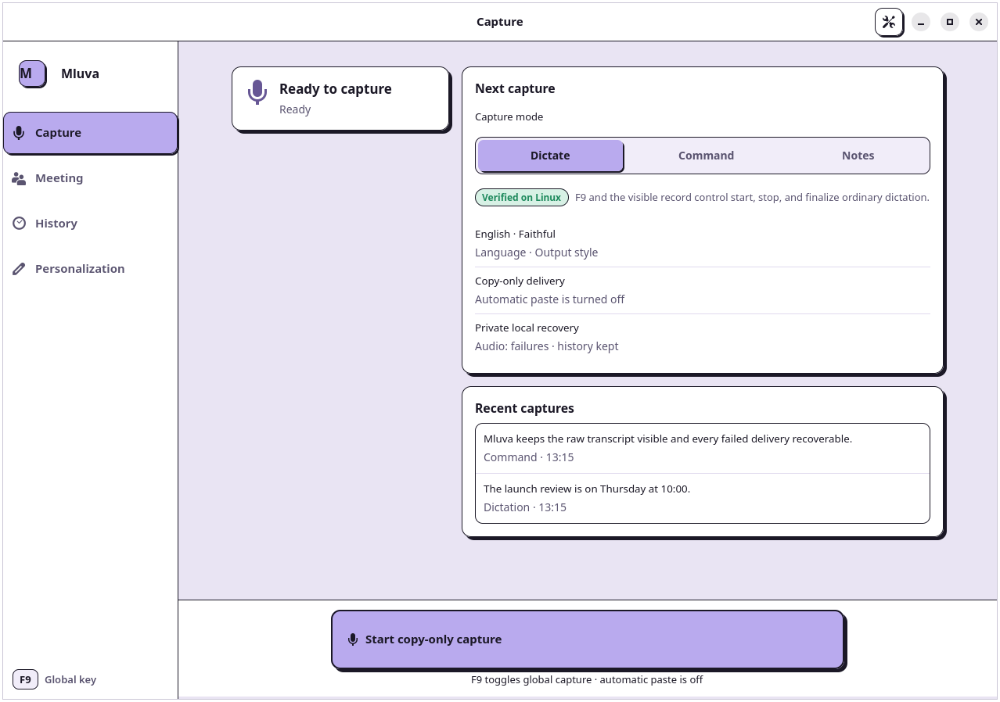
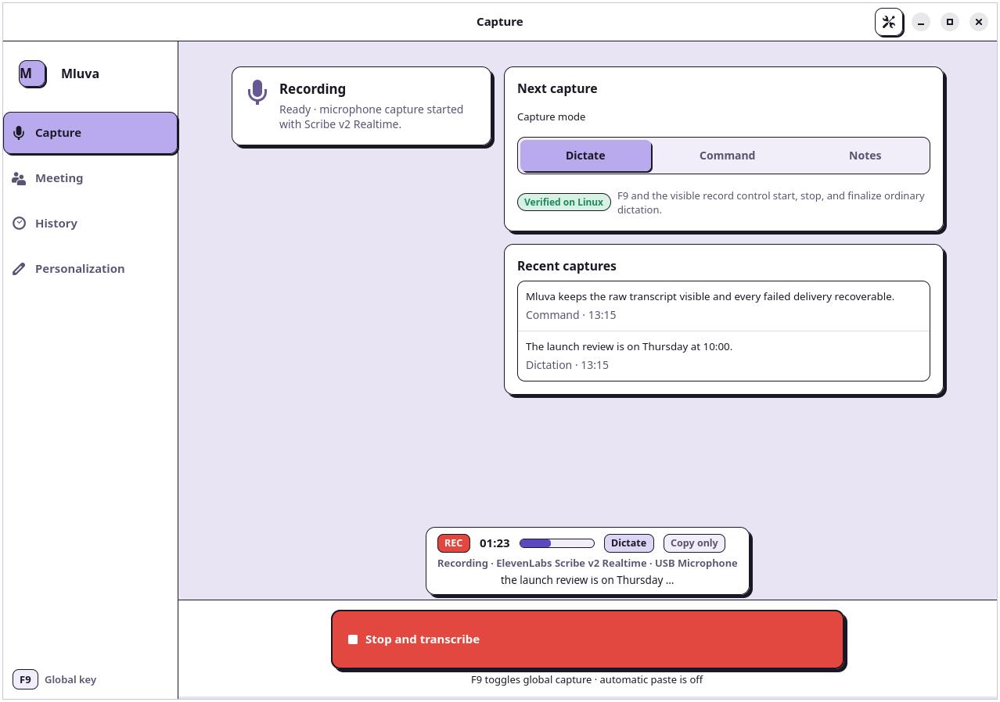

<p align="center"></p>

# Mluva

**Open-source AI dictation for Linux, with a source preview for macOS.**

Mluva is a native voice-input application for macOS and Linux. The macOS client transcribes privately with Apple Speech or streams harder technical and multilingual dictation to Google Cloud Speech-to-Text V2. The Linux client uses ElevenLabs Scribe v2 for recognition and the Codex app-server for optional faithful cleanup and Command mode. Linux always preserves the completed result on the clipboard. Its experimental automatic-insertion path may also return text to a safe restorable target, but that path is not reliable enough yet to claim as working.

<p align="center"> </p>

<p align="center"><sub>Capture overview and the transient live recording bar, rendered with synthetic data on an isolated virtual display.</sub></p>

Linux setup, dependencies, runtime behavior, and verification are documented in [linux/README.md](linux/README.md).

## Release status

| Platform | Status | Public support boundary |
| --- | --- | --- |
| Fedora Linux | Verified core with experimental surfaces | Fedora 44, GNOME Shell 50, and Wayland; recording and transcription, recording setup controls, History, and custom saved styles are manually accepted |
| macOS | Source preview | The implementation and deterministic tests are available, but no current public binary is separately verified, Developer ID signed, notarized, or updateable |

## Feature maturity

The Linux UI labels each public capability as **Verified on Linux** or **Experimental** from one shared capability registry. The current manually accepted set is recording and transcription, recording setup controls, History, and custom saved styles. Every other capability remains Experimental until it passes the same human acceptance boundary, regardless of automated coverage.

Automatic paste is an explicit experimental known limitation: it is disabled by default and does not currently work reliably in the current Fedora acceptance setup. Completed text remains recoverable on the clipboard. See the generated [feature-maturity matrix](docs/feature-maturity.md) for the complete current boundary.

## Install on Fedora Linux

Install the operating-system dependencies and `uv`, optionally install and authenticate Codex for cleanup or Command mode, and provide `ELEVENLABS_API_KEY` through a secret-aware process environment. Then install for the current user:

```bash
git clone https://github.com/1vecera/Mluva.git mluva
cd mluva
make linux-install
mluva
```

The installer does not reserve Right Alt/AltGr and does not require a logout for the application or F9 shortcut. Automatic paste into keyboard-only targets and the display-only bottom recording bar are separate, explicit helpers documented in the [Linux guide](linux/README.md).

## Current product surface

The list below describes implemented surface area, not a blanket reliability claim. Anything outside the verified set above is labeled Experimental in the application and in the [feature-maturity matrix](docs/feature-maturity.md).

- On supported Fedora GNOME, press the portal-approved F9 shortcut once to start and again to stop; Settings can propose any F1–F24 key, and global cancellation remains a separately approved portal shortcut.
- In the macOS source preview, hold Right Command and release to insert; double-tap for hands-free capture; Escape cancels. Normal Command-key shortcuts pass through, and the trigger is customizable in Settings.
- Switch to Command mode to edit selected text or draft from a spoken instruction; Mluva previews every result before changing the target application.
- Switch to Scratchpad mode for an editable draft that survives relaunch, preserves recovery audio until resolved outside Incognito, and only copies or inserts after explicit acceptance.
- Switch explicitly to Meeting mode to capture microphone and system audio together, then review the transcript, conservative summary, decisions, action items, and retained WAV in a private archive separate from dictation history.
- Use Apple Speech on-device where supported, with transparent legacy-session rollover, Google Cloud V2 streaming over native gRPC, or automatic privacy-aware routing.
- In Automatic, switch once to the permitted alternative after provider startup or finalization failure and record the reason; explicit provider choices never switch silently.
- See volatile recognition while only final text is delivered: macOS uses a floating overlay, while Fedora GNOME always provides an in-window live surface and can add an explicitly installed, display-only GNOME Shell bottom bar without giving it recording or input authority.
- On macOS, prefer accessibility-native insertion, then use the serialized pasteboard and Unicode-event fallbacks. On Linux, track authoritative AT-SPI focus events, restore the captured non-password target, install the complete text on the clipboard, prefer native editable-text insertion and trust its explicit success result, dispatch at most one keyboard paste only when native editing is unsupported, confirm that fallback through caret position without reading target text, and degrade uncertainty or an inaccessible target to recoverable clipboard guidance.
- Apply spoken punctuation, “scratch that,” filler removal, exact dictionary replacements with optional case matching, and snippets with deterministic date and time variables.
- Turn small manual history corrections into local, review-only vocabulary suggestions that can be added or dismissed; nothing is learned automatically.
- On macOS, optionally expand exact typed snippet triggers after Space, Tab, or Return using only an in-memory current-token buffer while excluding secure text fields and active dictation sessions. Linux supports spoken snippets and portable typed-trigger storage but does not run a desktop-wide key listener under GNOME Wayland; see the [Fedora GNOME platform profile](docs/linux-platform-profile.md).
- Scope dictionary replacements and snippets to an individual application.
- Apply optional on-device Apple Intelligence cleanup with fail-closed protection for technical tokens and facts.
- Apply built-in or custom saved writing styles, preview style changes in Scratchpad, and optionally remember mode, provider, and style for each application.
- Optionally use bounded application, window, selection, and nearby-text context for on-device rewriting, with per-application privacy controls and source labels in history.
- Retry recognition from retained PCM after provider failure and retry delivery independently.
- Inspect per-session capture, recognition, enhancement, and delivery latency, or export privacy-safe diagnostics without transcript, audio, application, or project identifiers.
- Inspect or restore raw recognition, rename, reprocess, copy, intentionally paste again, retry, export, or permanently delete owner-only local history with configurable retention; Incognito saves neither history nor recovery audio.

The behavioral source of truth is the [product contract](docs/product-contract.md). The [brand and compatibility contract](docs/brand-and-compatibility.md) explains which former technical identifiers remain stable for upgrades.

See the [changelog](CHANGELOG.md) for the initial release contents and its verified platform boundary, and the [third-party software inventory](THIRD_PARTY_NOTICES.md) for the dependencies resolved by each platform.

## macOS requirements

- macOS 14 or newer
- Xcode Command Line Tools with Swift
- A local code-signing identity in the login keychain for stable local app bundles
- Microphone access
- Speech Recognition access when using Apple Speech
- Accessibility access for the global shortcut, automatic insertion, and optional typed snippets; without it, Mluva copies finished text to the clipboard
- Screen Recording access only when capturing system audio in Meeting mode; Mluva consumes audio and does not retain video
- Google Cloud CLI Application Default Credentials and a project with Speech-to-Text enabled when using Google

## Linux requirements

- Fedora 44 with GNOME Shell 50, GTK 4, Libadwaita, PipeWire tools, AT-SPI, and the XDG Global Shortcuts portal for recording and cancellation
- Distribution Python 3.12 or newer with PyGObject and the base GObject introspection typelibs, plus `uv`
- An optional locally authenticated `codex` installation for cleanup, saved styles, and Command mode
- An ElevenLabs API key injected into the application process as `ELEVENLABS_API_KEY`; Mluva never writes the value to settings, history, logs, or diagnostics

## Build the macOS source preview

```bash
swift test
make setup-signing
make release
make install
```

`make setup-signing` verifies the existing self-signed `Voice Scribe Local Signing` identity in the login keychain. Mluva deliberately retains that local-only identity so macOS privacy grants survive the visual rename and rebuilds. If it is missing, the command opens Keychain Access and prints the exact Certificate Assistant settings needed to create it. Set `SIGNING_IDENTITY` to the exact name of another installed local identity when needed.

For Google Cloud recognition:

```bash
gcloud auth application-default login
```

Then select Google in Mluva settings, allow cloud recognition, and enter the Google Cloud project ID. The EU endpoint and Chirp 3 are the defaults. Mluva uses ADC unless you explicitly choose a service-account JSON; it stores only the file path and never copies the private key into preferences.

## Release packaging

`make distribution` remains available for a future paid release. It requires an Apple Developer Program `Developer ID Application` identity, enables the hardened runtime and microphone entitlement, timestamps the signature, submits the archive to Apple's notary service, staples and validates the ticket, and assesses the result with Gatekeeper. The default `notarytool` keychain profile is `voice-scribe`; set `NOTARY_PROFILE` to use another profile.

```bash
make distribution
```

CI uses `make ci-package` to validate the unsigned distribution shape with an ad-hoc signature. That mode refuses to run unless `CI=true` and is not available through the local release targets.

## License

Mluva is available under the [Apache License 2.0](LICENSE). Third-party components remain governed by the licenses listed in [THIRD_PARTY_NOTICES.md](THIRD_PARTY_NOTICES.md).
