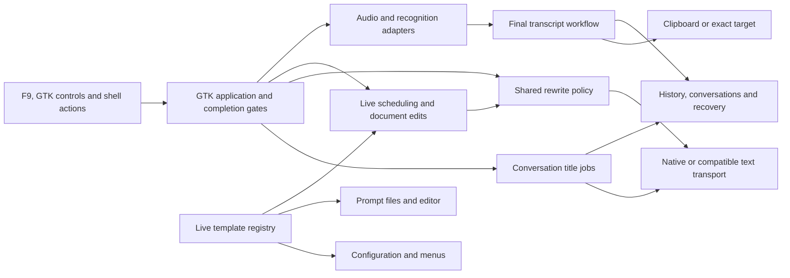

# Mluva architecture and feature-development review

Keep the native Python/GTK application and make its feature boundaries explicit. The highest-value change is to let a feature own its request, state and persistence rules while GTK owns presentation. A wholesale language rewrite has no measured justification yet. This review offers 20 concrete ideas, including 12 radical alternatives, and implements three bounded steps toward that direction.

Reviewed on 2026-09-14 against `a4cf1a6` on the remote default branch. This is the current **Linux/Omarchy** application: the public tree has already removed the former Swift/macOS preview. Fedora GNOME is a compatibility target with older manual acceptance. The completed simplification in PR #21 and prompt-editor work in PR #30 are the starting point, not outstanding work. Product behavior is defined by the [product contract](product-contract.md) and [platform profile](linux-platform-profile.md).

## Scope and evidence

The audit followed capture through recording, recognition, deterministic cleanup, optional model transformation, editing, persistence, delivery and recovery; then traced provider selection, prompts, automatic titles, commands, settings, the desktop bridge, installation and verification. It combines source inspection, dependency/function counts, deterministic tests, protocol fixtures and native offscreen checks. It is not a penetration test, a live-provider benchmark or renewed Wayland acceptance.

| Area | Current owners and behavior | Feature-development friction |
| --- | --- | --- |
| Application and presentation | `app.py` composes GTK, settings, recording lifecycle, worker callbacks and navigation; `conversation_view.py` owns editable documents; `markdown_view.py` and `mermaid_view.py` render content. | Many independent features require editing the same application class. Settings construction alone is 218 lines; conversation content construction is 184 lines. |
| Capture and recognition | `audio.py`, `pipewire.py`, `realtime.py`, `batch_preview.py`, `elevenlabs.py`, `providers.py`; audio is signed little-endian 16 kHz, 16-bit mono. | Good transport separation exists, but preparation, stop, fallback and completion still depend on numerous application fields. |
| Final processing and delivery | `workflow.py`, `segment_cleanup.py`, `transcript.py`, `personalization.py`, `delivery.py`, `text_target.py`. | `DictationWorkflow.complete` is 393 lines. A nominally platform-neutral workflow imports an AT-SPI module for a size constant, so core tests inherit desktop dependencies. |
| Live and conversation rewriting | `live_rewrite.py` owns scheduling; `app.py` owned both execution policies and their revision/session gates. | Native-model selection, HTTP aliases and speed policy were independently implemented in the two paths. |
| Prompts and feature discovery | `prompt_defaults.py`, `prompts.py`, `prompt_editor.py`, `workspace_settings.py`, `command_palette.py`. | A Live mode required coordinated edits in four runtime modules, including duplicated instruction and initial-draft mappings. |
| Durable documents | `history.py` and `conversation.py` share SQLite; Meeting, Scratchpad and personalization use separate JSON stores. | Rename/deletion/editing semantics differ between stores. Schema upgrades are embedded in initialization; there is no unified document revision model. |
| Titles and background work | Title queue, worker, cancellation and commit logic were embedded in `app.py`; SQL compare-and-set lives in `conversation_titles.py`. | Testing title lifecycle required application state and GTK dispatch even though generation itself has no UI responsibility. |
| Desktop control | `global_shortcuts.py`, `overlay_state.py`, `shell_bridge.py`; three QML files plus `TextMotion.js`; optional GNOME extension. | There is already a narrow status/action bridge, but most operations still depend on the GTK application instance. It is not a general document API. |
| Distribution and feedback | Source installer, locked `uv` dependencies, Make targets, offscreen GTK scenarios and dispatch-only GitHub CI. | Native setup is Linux-specific. This review could reuse a local Fedora image, but the current tree has no maintained container build recipe. |

The baseline contains **52 Python runtime modules, 21,028 lines, 41 pytest modules and 876 QML lines**. `app.py` contributes **5,117 lines (24.3%)**, imports 36 internal modules, and contains 181 function definitions including nested callbacks. These are navigation indicators, not a claim that line count measures quality. Baseline `make linux-test linux-shortcut-test` passed 440 tests, lint, formatting, generated-feature consistency and the private portal lifecycle check in 9.854 seconds; pytest itself took 6.64 seconds. The existing suite is already fast enough that deleting coverage would target the wrong bottleneck.

There is substantial behavior worth preserving: immutable recognition, separate editable text, committed-final reconciliation, manual-edit revision checks, exact-target insertion, bounded streams, privacy-aware recovery, SQL title compare-and-set and real protocol fixtures. The remaining structural risk is their distribution across large orchestrators. A rewrite that discards these invariants would make feature work harder initially.

## Three implemented improvements

| Improvement | Concrete before → after | Extension and regression boundary |
| --- | --- | --- |
| Shared rewrite policy | Both Live and conversation workers now call [`rewriting.rewrite_text`](../linux/mluva_linux/rewriting.py). An explicit `RewriteClient` protocol and immutable result replace transport-specific UI branches. One factory owns provider construction. | Add model/speed policy once. Native aliases, advertised effort/tier, compatible deployment aliases, streaming and the 40,000-character output limit use one path. Full-document UI commit gates remain in their callbacks. |
| One Live template definition | [`prompt_defaults.LIVE_TEMPLATES`](../linux/mluva_linux/prompt_defaults.py) supplies configuration validation, ordered choices, editable prompt records, instructions and optional initial structures. | A new mode is declared once, then tested. Existing file identities, ordering, all 11 built-in prompt definitions and generated prompts for all five modes match the baseline byte-for-byte. Custom legacy instructions and per-recording snapshots remain supported. |
| Independent title jobs | [`ConversationTitleJobs`](../linux/mluva_linux/title_jobs.py) owns its bounded queue, worker lifecycle, settings/prompt snapshot and title commit checks. GTK injects configuration access, label refresh and main-thread dispatch. | Change title scheduling without constructing a GTK application. Real SQLite tests cover queue pressure, cancellation, replacement, Incognito, disabled generation, deletion, renaming, human-cleared titles and frozen requests. |

Two small behavior corrections accompany the rewrite extraction. Compatible HTTP clients now receive the requested short catalog/title timeout settings instead of silently retaining 60 seconds. A compatible full-document rewrite with no configured alias now fails before network dispatch with the same actionable error in both paths; it does not try optional model discovery. Native speed choices do not leak into compatible-provider requests. Native transport defaults remain 30 seconds for protocol requests and 180 seconds for turns; ordinary compatible requests retain 60 seconds. These settings are transport timeouts, not a measured end-to-end latency guarantee.

The application file falls to **5,014 lines**, while total Python runtime grows to **21,190 lines across 54 modules**. The added interfaces and explicit job owner cost some code; the gain is isolated policy and testable ownership. The large application class remains the main structural debt.

## Twelve radical rework options

These are alternatives and experiments, not a recommendation to implement all of them. Effort is relative: **M** means a contained feature migration; **L** spans multiple workflows or stores; **XL** changes the runtime or product architecture. None is a delivery estimate.

| Idea | Structural change and benefit for new features | First proof, cost and recommendation |
| --- | --- | --- |
| Headless application core | Move recording, editing and rewrite use cases behind typed inputs/results; GTK and QML become adapters. New behavior can run from a test or script without importing GTK. | Extract one complete pasted-text rewrite with real storage and fake provider; assert no `gi` import and the same edit/privacy guards. **L; strongest long-term direction.** Avoid replacing the whole app at once. |
| A local Mluva daemon | Own capture, jobs and documents in a per-user process; expose versioned commands/events through a local socket or D-Bus. Windows become disposable views, and external tools can use Mluva directly. | Start a synthetic capture, disconnect/reconnect a view, and finish without losing the document or duplicating delivery. **XL; prototype only when a second client is needed.** Authentication, lifecycle, cancellation and upgrades become new responsibilities. |
| Explicit capture state machine | Replace interacting preparation/recording/processing/retry booleans and pending fields with typed states and permitted transitions. New pause/resume or recovery features become explicit transitions. | Model start → stop-during-prepare → cancel → late completion; replay every existing lifecycle case before moving production state. **L; high-value next architectural experiment.** State payloads must keep exact session and target identity. |
| A revision-based document model | Represent raw recognition, working source, draft candidate and accepted reply as distinct immutable revisions. Apply edits and model results against an expected revision. | Exercise simultaneous manual edit, delayed rewrite and navigation; prove raw text never changes and stale candidates cannot overwrite a newer version. **L; useful before richer editing or concurrent clients.** Requires deliberate migration and UX for conflicts. |
| Command-first application API | Turn user intentions such as rewrite, save, copy, cancel and open into typed use cases shared by Ctrl+P, the widget and a CLI. Add automation without synthesizing clicks. | Implement `rewrite(document_id, expected_revision, instruction)` behind the existing actions and a headless test. **L; preferred before the daemon.** Clipboard and insertion commands must remain explicitly distinguished from pure document operations. |
| Self-contained feature bundles | Give a feature one declaration for prompts, available actions, settings, status and use-case entrypoints. A new coaching mode can bring its own tested components without growing multiple registries. | Build one optional mode using the Live registry as the first building block; require explicit dependencies and no arbitrary import-time execution. **L; defer until a second substantially different mode needs more than prompt text.** A generic plugin framework could become the new bottleneck. |
| A staged transformation engine | Express recognition → deterministic normalization → optional cleanup → candidate validation → acceptance → delivery as typed stages with explicit failure results. New processors insert at a named boundary. | Move one existing cleanup path without changing its order, fallback or token-integrity behavior; inject failure between stages and compare recovery output. **L; promising after workflow decomposition.** Do not turn privacy and exact-once delivery into optional middleware. |
| Capability-based provider adapters | Replace Codex-shaped metadata and provider checks across workflows/UI with speech/text capabilities, explicit budgets, model selection and cancellation contracts. | Add a test-only text adapter implementing only advertised capabilities, then run the same rewrite and failure corpus. **L; the shared rewrite policy is the first step.** Model discovery must remain optional for compatible endpoints; streaming and batch speech differ. |
| One transactional document store | Move conversations, Meeting and Scratchpad behind a single SQLite document/recovery model, with explicit migrations and a transaction boundary. New search, tags and export features stop implementing three persistence paths. | Import a synthetic old profile, compare every raw/edited value, simulate interruption and verify deletion removes only managed audio. **L; defer until cross-document features justify migration.** Keep nonsecret settings and editable prompt files external. |
| An operation journal | Record document edits and accepted transformations as replayable operations, enabling undo, recovery and deterministic bug reproduction. Current projections remain the UI/read model. | Reconstruct one conversation exactly from a synthetic journal and prove permanent deletion and retention remove both operations and projections. **XL; conditional on undo/audit requirements.** Incognito must never journal; durable logs must not retain deleted text accidentally. |
| Disposable worker processes | Run speech/model work in isolated workers with typed input/output and explicit cancellation. Provider failures or blocked libraries can be terminated without freezing application control. | Kill a synthetic worker during finalization and recover the original plus a retryable failure, with no duplicate clipboard write. **L; pursue if measurements show uncancellable work.** Costs IPC, serialization, process supervision and secret-scoping complexity. |
| Replace the UI/runtime with Tauri and Rust | Rebuild the workspace as a web UI around a Rust application core. A web-oriented team could iterate more directly on complex editing components and share tooling. | Port one editing flow and measure startup, memory, accessibility, theme fidelity, provider cancellation and Omarchy integration against the current implementation. **XL; not recommended now.** Native portal, audio, privacy and document semantics still need to be implemented and verified. |

The daemon and command API are separable: prove the in-process API first. A transactional store and an operation journal solve different problems; neither should become an implicit prerequisite for a simple new feature. A language change without fixing ownership would reproduce the current coupling in a new syntax.

## Eight practical improvements

| Idea | Feature-development benefit | Proof or next step |
| --- | --- | --- |
| Shared rewrite policy | One owner for provider construction, aliases, effort, tiers and full-document execution. | **Implemented.** Local JSONL and HTTP tests cover both snapshot and streamed use. |
| Live template registry | Add a mode in one declaration; menus, config and prompt editing follow it. | **Implemented.** Compatibility comparison plus persisted-config/override tests for all five modes. |
| Title job component | Title policy can evolve with deterministic scheduling and real persistence tests outside GTK. | **Implemented.** Explicit callback dispatch and identity checks retain existing native title lifecycle coverage. |
| Independent preference components | Move Capture, Audio and Privacy row construction out of the 218-line application builder into named components with explicit values/callbacks. | **Next small extraction.** Start with Audio; test save failure, recording lockout and device refresh without passing the entire app into the component. |
| A shared settings schema | Define numeric bounds, choices, defaults and human descriptions once for configuration validation and controls. | Consolidate one field group and prove malformed-file recovery, unknown-field preservation and atomic Apply still behave correctly. **M.** Keep side effects in explicit handlers. |
| A typed core import boundary | Prevent pure features from importing GTK/AT-SPI and check their public protocols with a targeted type checker. | Move the selection-size constant out of `text_target.py`; add an import-boundary check and type-check newly isolated modules first. **M.** Do not bury existing dynamic UI errors under broad ignores. |
| Decompose finalization by outcome | Split the 393-line `DictationWorkflow.complete` into named recognition, transformation, retention and delivery operations while keeping its current order. | Preserve exact output and failure/retry records for the existing corpus, including Incognito and partial capture. **M/L.** This is groundwork for a future staged engine, with no new execution framework. |
| Reproducible local Linux verification | Add a maintained container recipe and documented commands matching the existing CI dependencies and private-display runners. | A fresh checkout on a non-Linux host should reproduce the deterministic gate and native fixtures with no host desktop or credential mounts. **M.** Keep the roughly ten-second full deterministic gate; do not remove meaningful tests to chase speed. |

## Stack decision and implementation order

Keep Python/GTK for current product work. Its real strengths here are the working native integration, small runtime dependency set and fast tests. The present bottleneck is ownership and state coordination. PyGObject explicitly requires GTK work on the main thread and recommends dispatching worker results with `GLib.idle_add`; the extracted title feature retains that boundary. [PyGObject threading guide](https://pygobject.gnome.org/guide/threading.html).

Python protocols allow explicit interfaces without forcing every transport into an inheritance hierarchy. That supports the incremental core approach; it does not provide runtime validation or prove provider compatibility by itself. [Python typing reference](https://docs.python.org/3/library/typing.html#typing.Protocol).

Tauri would introduce a Rust core and platform webviews, including WebKitGTK on Linux. It could suit a different team or richer web-style editor, but it would not automatically replace PipeWire, portal or target-delivery logic. Selective Rust modules through PyO3 are another option if profiling identifies a CPU-bound hotspot; this audit found no evidence requiring one. These are inferences about Mluva's migration costs, informed by the [Tauri process model](https://v2.tauri.app/concept/process-model/) and [PyO3 guide](https://pyo3.rs/).

After these three changes, take the Audio preference extraction, then prototype a typed capture state and a headless rewrite use case. Measure progress with a concrete feature: how many owning modules must change, whether the feature can be exercised without GTK, and whether its cancellation/privacy cases run deterministically. Do not claim a percentage increase in development speed until comparable feature changes have been measured.

## Verification and remaining limits

Validation results are recorded below before handoff. All inputs are synthetic; desktop tests run in a separate Fedora container with private displays, session buses, accessibility services and XDG state. The existing user installation and visible desktop are outside that environment.

| Check | Result and scope |
| --- | --- |
| Full deterministic gate | `make linux-test linux-shortcut-test`: **472 passed**, Ruff lint/formatting and generated-feature check passed; private D-Bus portal registration, binding and lifecycle passed. Final run: pytest 6.54 seconds, complete command 7.122 seconds. Single-run timings are not a speed benchmark. |
| Native conversation and titles | `make linux-conversation-test`: passed all 14 scenarios, including real JSONL worker completion, title cancellation, rename/deletion, navigation, streaming and model-speed settings. Final run: 21.432 seconds. |
| Native Live | `make linux-live-rewrite-test`: passed provisional/final reconciliation, late results, manual edits, cancellation and clipboard gates; 13.083 seconds. |
| Native commands and prompts | `make linux-command-test` passed in 6.014 seconds. `make linux-prompt-test` passed all four size/error scenarios plus restart checks in 22.495 seconds. |
| Portable core | The documented `uv run --no-project --with pytest==9.1.1 pytest` command passed **36 tests on macOS without GTK** in 0.48 seconds. It covers rewrite policy and title lifecycle, not native Linux integration. |
| Diagram and fluid workspace | `make linux-fluid-workspace-test` passed in 9.874 seconds after installing WebKitGTK in the disposable container and applying a test-only WebKit sandbox workaround, described below. |
| Shell and source checks | ShellCheck passed for the contributor-guide command. `git diff --check` passed. The baseline/current prompt comparison verified all 11 built-ins, five choices and their generated prompts. All report links resolve. |
| Visual inspection | Inspected native wide conversation, narrow Live, minimum-size prompt editor and Grilling/diagram screenshots. The synthetic documents, controls and diagram were readable at the captured sizes. No UI layout change is included. |

The initial diagram smoke timed out on both the changed tree and unchanged `a4cf1a6` because the reused container image lacked WebKitGTK 6. After installing it inside this task's container, WebKit could not create a user namespace under Docker's restrictions. The successful synthetic render used `WEBKIT_DISABLE_SANDBOX_THIS_IS_DANGEROUS=1` only in that disposable container's test process. No production configuration or host security setting changed. This proves rendering and source preservation under the outer container boundary; it does **not** verify WebKit's own sandbox in a normal installation.

The container emitted existing GLib/Gdk deprecation notices, software-rendering warnings and a narrow GTK allocation warning. These were not treated as evidence of real Wayland behavior. QML/Hyprland, physical audio, real provider accounts, insertion into the user's applications and installed-release behavior were not reaccepted; those boundaries were not changed. CI is dispatch-only and no hosted run was requested.

The final diff review checked every changed call site, asynchronous identity/commit gate, preserved prompt ID/default and affected native fixture. It also added a regression case proving a title transport cleanup failure cannot strand the queue. Evidence logs, receipts, metrics, baseline comparison and screenshots remain under this worktree's `tmp/architecture-review/` and the individual scenario directories referenced by its logs. No schema migration, prompt-file rewrite or user-data change is needed to adopt the three improvements.
