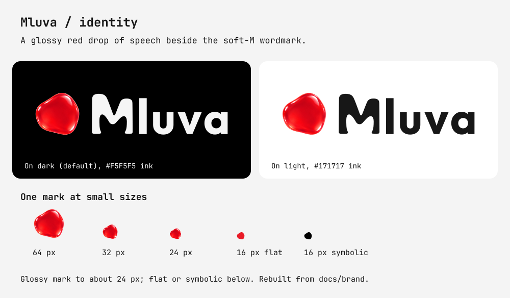

# Mluva brand and compatibility contract

The public product name is **Mluva** (roughly “MLOO-vah”), the Czech noun for speech or manner of speaking. The category descriptor is **Open-source AI dictation for Linux, with a source preview for macOS.** Public copy, application titles, launchers, distributable filenames, screenshots, and release notes use Mluva.

The September launch direction retains **Mluva** and the production identity below. The dictated variants Mlouva, Lluva and Blueva do not constitute a rename. The positioning is **“The most delightful dictation app for Omarchy”**: a design ambition expressed through calm motion, minimal chrome, editable text and native theming. Shipping with Omarchy and a dedicated bundled shortcut remain future aspirations.

## Production artwork



The mark is a flat optical redraw of the coordinator-selected **GPT Image 2.5 Sunburst** source: a flowing lowercase m that suggests a voice wave. The generated source had glow and soft alpha; the production geometry removes them, regularizes the curves and opens the internal gaps. It uses one silhouette at every size. A frost/slate version fits Nord; solid ink and theme-colored versions work independently of that palette.

The exact **Mluva** wordmark is Adwaita Sans SemiBold converted to paths with PangoCairo. It contains no generated lettering and needs no installed font when displayed. [Font provenance and the committed outlines](assets/brand-source/wordmark-provenance.json) keep its source inspectable; the [font license](assets/brand-source/Adwaita-Sans-LICENSE.txt) is retained.

| Surface | Canonical asset | Use |
| --- | --- | --- |
| Linux application launcher | [`com.voicescribe.Linux.svg`](../linux/resources/com.voicescribe.Linux.svg) | Frost mark in a slate tile; installed through the existing desktop identity. |
| GTK chrome and GNOME panel | [`mluva-symbolic.svg`](../linux/gnome-extension/recording-status@voicescribe.local/mluva-symbolic.svg) | Transparent `currentColor` silhouette for native theme recoloring. |
| Standalone mark | [`mluva-mark.svg`](assets/mluva-mark.svg) / [PNG](assets/mluva-mark.png) | Frost on a dark surface; [solid ink variant](assets/mluva-mark-on-light.svg) on light. |
| Exact wordmark | [`mluva-wordmark.svg`](assets/mluva-wordmark.svg) / [PNG](assets/mluva-wordmark.png) | Light lettering on dark; [ink variant](assets/mluva-wordmark-on-light.svg) on light. |
| Horizontal lockup | [`mluva-lockup.svg`](assets/mluva-lockup.svg) / [PNG](assets/mluva-lockup.png) | Mark plus wordmark on dark; [ink variant](assets/mluva-lockup-on-light.svg) on light. Transparent variants are replaceable media inputs. |
| README introduction | [`mluva-hero.svg`](assets/mluva-hero.svg) | Outlined name, flat mark and software-rendered campaign copy. |
| Visual review | [`mluva-brand-sheet.svg`](assets/mluva-brand-sheet.svg) | Dark/light contrast and small-size specimens; use the symbol alone below a 160 px lockup width. |

Preserve aspect ratio and the built-in clear space. Use the solid ink variant on white rather than pale cyan for a small mark. The lockup defaults to light lettering; it needs a dark background. PNGs are rendered locally at twice each SVG's native size. Standard regeneration uses the committed wordmark outlines and makes no image-service requests:

```sh
make linux-setup
cd linux
uv run --locked python -m voice_scribe_linux.brand_assets --png
```

`--png` requires `rsvg-convert` from librsvg. The generated-asset drift check runs with `make linux-test`.

## Audit and provenance

Before this pass, the Linux launcher, GNOME/GTK symbolic mark and README hero used a mint speech bubble with three bars generated by `brand_assets.py`. The repository had no standalone outlined wordmark. No Figma links, `.fig` assets or Code Connect references were found in tracked source at `18004cc`.

The macOS source preview has no bundled app-icon asset or `CFBundleIconFile` entry; its status item uses system symbols. Mac packaging is a separate platform gap, not evidence of a completed macOS identity rollout. The Quickshell runtime uses its existing native controls and title. Media and capture tooling under `dev/` and `docs/promotion/` are owned by the media pass; historical images keep their original artwork and capture labels.

The [selected source PNG](assets/brand-source/mluva-mark-sunburst.png), [exact prompt](assets/brand-source/prompt.txt), [request parameters](assets/brand-source/request.json), [provider response](assets/brand-source/response.json) and [coordinator provenance](assets/brand-source/provenance.json) are preserved in the repository. The supplied endpoint is `openai/gpt-image-2.5/sunburst/text-to-image`, request `01a086dd-a16f-76c0-9d3f-d3a50787a734`. This distinguishes the generated concept from the subsequent software vector refinement. The earlier built-in ImageGen exploration was discarded; it is not the production source. The glowing raster is evidence only and is not installed as an icon.

## Upgrade continuity

The first Mluva release intentionally retains several Voice Scribe-era technical identifiers. Changing them during a visual rename would reset desktop approvals, split local history, or disconnect an already reviewed secret reference. They are compatibility contracts, not alternate public names.

- macOS keeps the `VoiceScribeMac` Swift target and executable, the `com.voicescribe.mac` bundle identifier, the `VoiceScribe` Application Support directory, and the existing local signing and notarization profile names. The bundle and installed application are displayed as `Mluva.app`.
- Linux keeps the `voice_scribe_linux` Python module, `com.voicescribe.Linux` application and D-Bus identity, `voice-scribe` XDG storage roots, `recording-status@voicescribe.local` GNOME extension UUID, `voice-scribe-input@.service` systemd unit, and the owner-only `voice-scribe` managed-secret profile.
- Linux installs `mluva`, `mluva-input-helper`, and `mluva-overlay` as the canonical commands. The previous `voice-scribe`, `voice-scribe-input-helper`, and `voice-scribe-overlay` commands remain compatibility aliases so existing shortcuts and instructions do not fail abruptly.

Any later identifier migration must copy or adopt existing data atomically, preserve permissions, remove stale launch entries, and verify upgraded installations before the legacy identifiers are retired.

## Naming boundaries

Mluva is the project’s brand, not a claim that transcription runs locally. Linux supports ElevenLabs cloud recognition, local Voxtype/Whisper and a compatible transcription endpoint. Rewriting, cleanup and titles use Codex app-server or a compatible chat endpoint. Local recognition alone does not make the other processing local. macOS has separate Apple Speech and Google Cloud routes. The [provider matrix](feature-story.md#provider-matrix) records these adapters and their deployment limits.

Preliminary exact-name research found no current software or dictation product named Mluva. It did find the separate Czech communication platform `mluvii` and the phrase and registered mark `Nová mluva`. This research is a collision screen, not legal or trademark clearance.
