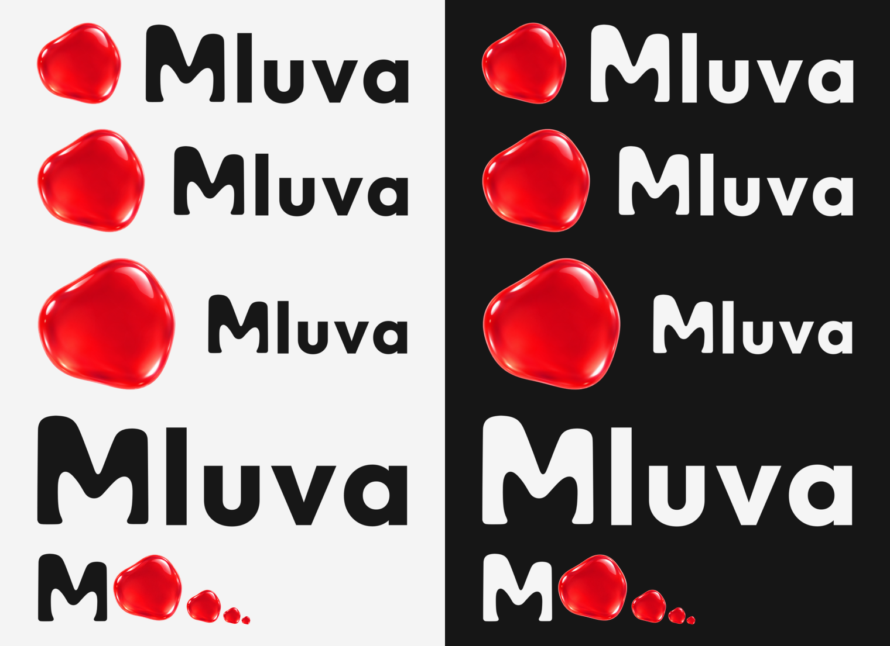

# Mluva logo set

The final Mluva identity: a glossy red mark on the left and the **Mluva** wordmark with its soft M on the right. Every file here is generated by [build.py](build.py) from the committed [sources](source/provenance.json); edit the sources or the constants in the script, rebuild, and commit the result.



## Defaults

- **Lockup:** `mluva-logo-on-dark.svg`, the compact 1.05 ratio, where the mark reads like a letter of the word.
- **Tone:** the `-on-dark` variants with #F5F5F5 ink. Use `-on-light` (#171717 ink) only on light surfaces.
- **Background:** transparent. When a surface needs a background, use black (#000000).

## Horizontal logo, three ratios

The wordmark is the same in all three; only the mark size and gap change. Ratio means mark height divided by M height.

| File (`svg/`) | Ratio | Use |
| --- | --- | --- |
| `mluva-logo-on-dark.svg` · `-on-light.svg` | 1.05 | Default. Title bars, navigation, README, site header, footers. |
| `mluva-logo-medium-mark-on-dark.svg` · `-on-light.svg` | 1.50 | Icon-plus-name lockup for dialogs and cards. |
| `mluva-logo-large-mark-on-dark.svg` · `-on-light.svg` | 2.25 | About screens, social cards, splash surfaces where the mark leads. |

Each lockup is about 53 KB (the glossy mark is 49 KB of that). PNG renders at 1200 px wide with a transparent background are in `png/` under the same names.

## Parts

| Asset | Files | Notes |
| --- | --- | --- |
| Wordmark | `svg/mluva-wordmark-on-dark.svg`, `-on-light.svg`, `png/` at 1200 px | "Mluva" with the traced soft M, tight viewBox. |
| M monogram | `svg/mluva-m-on-dark.svg`, `-on-light.svg`, `png/` at 512 px | Square framing, 4% margin; avatars and placeholders. |
| Glossy mark | `svg/mluva-mark.svg` | Square framing that matches the PNG icons. |
| Flat mark | `svg/mluva-mark-flat.svg` | One red shape (#E91B27) for tiny sizes, print, single-colour contexts. |
| Symbolic mark | `svg/mluva-mark-symbolic.svg` | `currentColor` silhouette for GTK, GNOME panel or Safari pinned tabs. |
| Icon PNGs | `png/mluva-mark-{16,32,48,64,96,128,192,256,512,1024}.png` | Cut from the raster master with the same framing as the SVG mark. |
| Windows / favicon | `mluva.ico` | 16, 24, 32, 48, 64, 128 and 256 px entries, PNG-compressed. Copy as `favicon.ico`. |

## Rules of thumb

- Keep the ratios; scale a lockup as one object. Every viewBox is tight (2% padding), so add clear space of at least half the mark height around it.
- Use the glossy mark down to about 24 px. Below that prefer the flat or symbolic mark; the 16 px PNG still reads as the red mark.
- App tiles and other surfaces that need an opaque background take the glossy mark on black.

## Rebuild

```sh
uv run docs/brand/build.py
```

Needs `rsvg-convert` (librsvg, the renderer GTK uses) and `magick` (ImageMagick 7). The script clears `svg/` and `png/` and regenerates them, then prints the SVG sizes and the wordmark metrics: M height 53.46, wordmark 181.50 × 54.50 design units, baseline at 53.84.

Then refresh the surfaces composed from this set (the `docs/assets` copies, the launcher tile, the GNOME symbolic icon and the site favicon) with `cd linux && uv run --locked python -m mluva_linux.brand_assets --png`; `make linux-test` checks them for drift. See the [identity contract](../brand-and-compatibility.md).
