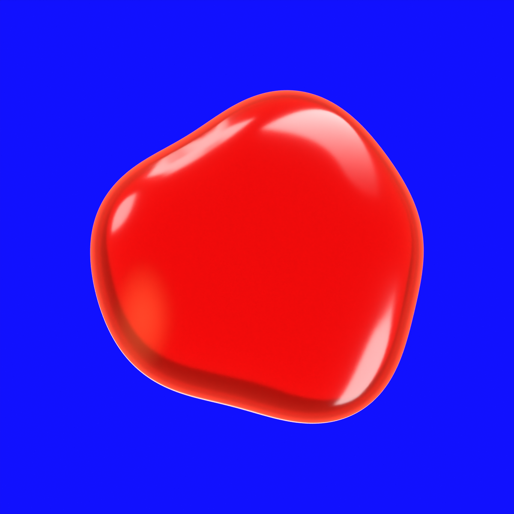

# Electric Jelly / Blender study

Editable 3D recreation of the Electric Jelly material, continuing the selected vector study. The original Figma studies are preserved; the new comparison sits beside them on **Logo Review**.

[Figma comparison](https://www.figma.com/design/4mdtod74gknaCCm8q1nrDj?node-id=214-11) · [Material reference](https://www.figma.com/design/4mdtod74gknaCCm8q1nrDj?node-id=203-1673) · [Selected vector](https://www.figma.com/design/4mdtod74gknaCCm8q1nrDj?node-id=206-1681)



## Files

- `electric-jelly.blend`: closed logo mesh, subdivision modifier, red gel material, orthographic camera, transmitted backlight and five shaped reflection cards. The **Rendering** workspace contains a packed hero preview; **Layout** contains the editable model.
- `renders/electric-jelly.png`: 1200 × 1200 hero on electric blue.
- `renders/electric-jelly-transparent.png`: 1200 × 1200 RGBA mark with a transparent exterior.
- `source/figma-contour.svg`: exact exported contour from node `206:1683`, inside the selected study.
- `source/reflection-cards.json`: editable highlight footprints and brightness settings, refined against the material reference.
- `source/material-reference.png` and `source/selected-vector.png`: the source images used for comparison.
- `create_electric_jelly.py` and `reflection_cards.py`: reproducible Blender 5.2 generation scripts; no additional Python packages are required inside Blender.

## How the appearance works

The exported outline is smoothly sampled and inflated into a closed lens. Its red material combines transmission, subsurface scattering, volume absorption and a clear coat. A thin coral edge glow helps the silhouette separate from the blue background.

The white streaks are reflections of real luminous meshes outside the logo. Their positions are calculated by reflecting camera rays around the logo's interpolated surface normals. This creates curved highlights while keeping the logo itself an editable, untextured mesh. The reflection cards are hidden in the modeling viewport; use Alt-H to inspect them. Adjust their material's **Emission Strength** to rebalance a highlight.

This is a study for the front hero view. The reference still has more irregular folds and a softer, brighter rim. Turning or deforming the logo changes the reflections; re-aim the studio cards for a new composition. No motion loop is included, and no application icon is replaced.

## Rebuild

Run from this folder using Blender 5.2. The command preserves existing scenes in the fresh Blender process and refuses to overwrite the output unless `--force` is given.

```sh
blender --background --factory-startup --python create_electric_jelly.py -- --output ./electric-jelly.blend --render --force
```

On macOS, the Blender executable can be `/Applications/Blender.app/Contents/MacOS/Blender`. For a quick preview, add `--size 512 --samples 32`. Defaults are 1200 pixels and 128 Cycles samples, with Metal GPU rendering when available and CPU otherwise. Render paths inside the saved scene are relative.

## Verification

The scene was rebuilt in a fresh Blender 5.2.1 process, rendered on blue and with transparency, reloaded through Blender MCP, and inspected through Blender's desktop UI. The logo has 20,226 base vertices, 20,480 faces, zero non-manifold edges and positive enclosed volume. Both PNGs have the expected dimensions and alpha behavior. Ruff and the Git whitespace check pass. Application tests are outside this artifact-only change.
