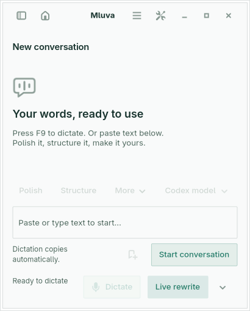
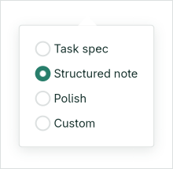
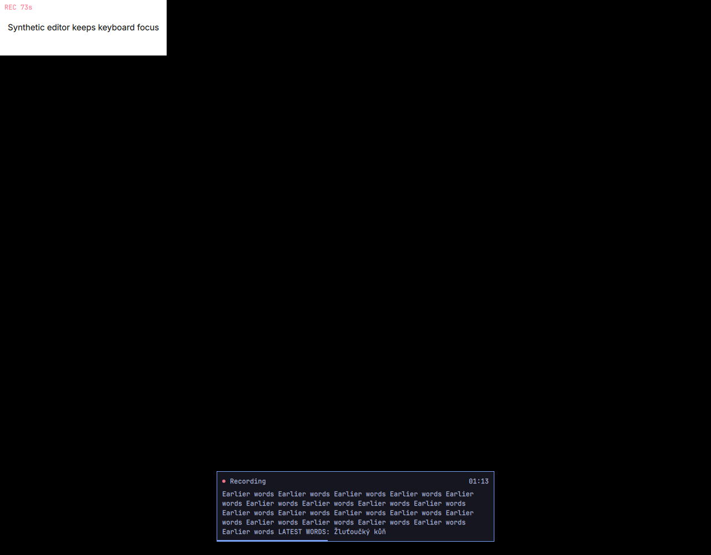

# Live rewrite latency and recording motion

S27-459 starts a clearly provisional draft after 40 recognized characters or a short paused utterance, then coalesces updates without overlapping requests. Live rewrite is opt-in. The small initial gate avoids opening-filler requests while bypassing the larger threshold for subsequent updates. Stop always reconciles against committed recognition before automatic copying. The main Live rewrite control saves its template selection through the same settings path as Workspace. The recording header and timer stay in their existing position; the five-line preview and GTK document followers retain spare room, eased movement and manual reading position.

## Controlled scheduler-to-visible measurement

Measured on Lenovo on 2026-09-09, against v0.3.0 commit `4ce8dc49537da98d8f32f25726f63193774d3b91` and this change. The production GTK app, scheduler and Codex transport ran on private Xvfb `:192`; speech events and the independent JSONL model subprocess were synthetic. The fixture's `gpt-5.4` identifier is test data. No cloud model or microphone was used for this comparison.

Both runs received committed snapshots of 43, 112 and 203 characters at 0, 2 and 4 seconds, using the default 160-character grouping and four-second request interval. The baseline waited for 203 characters. The updated scheduler started on the first 43. Visibility means GTK's `after-paint` event with the completed result's ending inside the draft viewport, rather than a model request, text delta or template appearing.

| Stage, median of three runs | v0.3.0 | Updated |
| --- | ---: | ---: |
| First committed speech → request dispatch | 4,072.04 ms | 0.19 ms |
| Process/model setup | 64.76 ms | 17.74 ms |
| Provider transform, controlled 500 ms response | 501.85 ms | 500.76 ms |
| Transform completion → visible paint | 15.91 ms | 8.11 ms |
| First committed speech → visible draft | **4,654.57 ms** | **526.25 ms** |

Total ranges were 4,651.56–4,668.25 ms before and 525.20–562.29 ms after. Stage medians need not sum to the total median. Setup varies with process startup and machine load; the scheduler accounts for the material improvement. These numbers exclude audio collection and speech-provider commitment, so they are not speech-to-draft latency promises. Per-run receipts: [baseline](reviews/s27-459/baseline-controlled.json), [updated](reviews/s27-459/after-controlled.json).

## Speech-provider boundary

The original S27-461 `task-v2` real capture used Scribe v2 Realtime and `glm-4.7-flash`. Its first committed transcript arrived at 28.6530 seconds, its second at 44.2673 seconds, and its first rewrite result at 52.7883 seconds, after Stop at 44.0215 seconds. That capture recorded the result callback, not GTK paint. Its final rewrite returned empty, so production retained a labeled partial draft. Those results cannot establish successful finalization or a visible draft during recording.

All recording retains the established 25-second manual commit cadence. An opt-in Live draft may use provisional recognition, identified as such in the UI and model context. Stop always requests reconciliation against the complete committed transcript, including when the preview text is identical. A commit covers all audio already sent, Stop flushes only the remaining tail and waits for every segment callback, and cancellation prevents a further commit after a blocked send returns. Provisional recognition never becomes raw text or automatic dictation delivery. Incognito, Notes, Command and ordinary dictation do not send it to the rewrite model.

The choice follows a rejected real experiment. A four-second Scribe commit cadence reached the first committed text at 4.676 seconds after first PCM and the first `glm-4.7-flash` HTTP request at 4.705 seconds, but lost the missing-order-ID, preview-before-save and totals-match-upload requirements around 20–28 seconds. It also invented an order-number-field instruction. Raw assembly exactly matched all received committed segments, locating the loss in recognition rather than final assembly. The rewrite returned HTTP 429 at 5.360 seconds; there was no generated or painted draft. Stop sent the remaining audio at offset 40.832 seconds and completed with a labeled partial template. That cadence is not included in this change.

ElevenLabs recommends generally 20–30-second commits and logical speech boundaries for transcription quality; frequent commits can reduce quality. The observed loss supports keeping that recognition boundary and using provisional text only for the opt-in draft. See the provider's [transcript and commit guidance](https://elevenlabs.io/docs/eleven-api/guides/how-to/speech-to-text/realtime/transcripts-and-commit-strategies.mdx).

## Selected final real capture

The accepted take used exact commit `cdc00237595f8cfb29e75cd87a980311ea3bcc98`, including the 40-character-or-pause initial gate and provider-settings PR #14. It used the same full Fish speech file, Scribe's 25-second commits and `gpt-5.6-luna` at low effort/default service tier. The configured later thresholds remained 160 characters/four seconds. All 119 recorded runtime files were verified unchanged afterward. No additional provider call followed this take.

| Observable stage | Seconds after first PCM |
| --- | ---: |
| First actual model `turn/start` request | 4.919 |
| First speech-derived, incomplete Intent field painted | **11.057** |
| Task, Intent and Requirements painted while speech is active | **22.730** |
| First committed recognition received | 25.378 |
| Expanded draft painted; recording active, voiced source already ended | 34.603 |
| Stop | 40.742 |
| Canonical final request | 46.773 |
| Final saved result painted | 54.911 |

The first field update is not a filled task. The substantial task structure arrives while the source is still voiced; the expanded update at 34.603 seconds follows the approximately 33.67-second end of voiced speech. Five sequential requests produced one saved final reply. Raw recognition exactly matches every received committed segment; the missing-ID, preview and totals requirements and open owner/deadline are retained. The result still needs review: raw preserves “check crowns” and an extra owner sentence during padded silence, and the final success criteria narrow “bad rows” to rows missing order identifiers. Open owner/deadline information is expressed in prose rather than literal `[Missing]` markers. This is one observed run, with no general latency or accuracy promise.

The [selected receipt summary](reviews/s27-459/real-native.json) contains separate stages, caveats, the raw hash and runtime verification. Full evidence is in the media worktree's `tmp/campaign/s27-459-selected-native/`, including `capture.json`, `runtime-verification.json`, `runtime-files.json`, raw recognition, final reply, audio and video. That exact runtime is the final implementation; subsequent commits update evidence only.

## Earlier provisional-input capture

An initial provisional-input capture used the same 40.716-second Fish speech file through real private PipeWire, Scribe v2 Realtime and the authenticated Codex app-server on `:193`. The catalog-selected model was `gpt-5.6-luna`, low effort, Fast off / default service tier. It used the default 160-character grouping and four-second request interval, before adding the final 40-character-or-pause initial gate. These results describe one observed run, not a general latency or recognition-quality benchmark.

| Observable stage | Seconds after first PCM |
| --- | ---: |
| First rewrite setup | 2.356 |
| First actual model `turn/start` request | 3.002 |
| Model echoes the unchanged initial template; excluded from meaningful-draft timing | 8.148 |
| First meaningful generated draft painted, while speaking and recording | **19.120** |
| First committed speech received | 25.385 |
| Stop | 40.765 |
| Final committed reconciliation result | 53.925 |
| Final result painted | 53.954 |

Five model requests ran sequentially, including final reconciliation. The first request contained only the early speech fragment and returned the unchanged template; it is not counted as a meaningful visible draft. The later draft appeared before the first committed recognition and before voiced speech ended at approximately 33.67 seconds. Final recognition used the established 25-second commit plus the Stop tail at audio offset 40.832 seconds, with no batch fallback. Exactly one final reply was saved. Raw text exactly equals the concatenation of all received committed segments; both raw and final draft retain the missing-ID, preview and totals requirements, with unresolved owner/deadline information retained. Recognition still contains filler and wording errors, so this is not a verbatim-accuracy claim.

The [earlier-run summary](reviews/s27-459/real-native-before-initial-gate.json) records the separate stages, immutable raw hash and all 115 frozen runtime-file hashes. Full local evidence is under the S27-461 worktree's `tmp/campaign/s27-459-final-native/`, including `capture.json`, `runtime.patch`, `runtime-files.json`, `recognition.json`, `replies.json` and video. The failed cadence experiment and its `boundary-review.json` remain under `tmp/campaign/s27-459-experiment-real/`. The earlier captured implementation predates the provider-settings integration and final initial gate; its exact source is preserved by those hashes and patch.

## Verification and reproduction

`make linux-test` passes all 358 tests on the combined provider/Live branch, feature maturity validation, Ruff lint and formatting. `make linux-shortcut-test` passes the private portal lifecycle. `make linux-text-target-test linux-conversation-test linux-live-rewrite-test` passes on reserved `:192`, covering real cross-process AT-SPI focus capture, restoration and exact Unicode insertion, all 14 conversation scenarios and the Live workspace. This includes provisional input kept out of raw text, mandatory final reconciliation for matching previews, manual edits during an in-flight final update, one saved final reply, final-only rewrite copying, failed-final labeling, cancellation and Incognito.

The GTK motion fixture samples actual scroll positions, including repeated updates with the same destination and full draft replacement while reading above the bottom. The QML fixture samples intermediate scroll and dot-opacity values, keeps five preview lines and the header/timer, checks bounded Unicode prefix changes, and verifies static output when smooth scrolling is off or duration is zero. Desktop reduced motion is tested at the GTK-to-QML bridge. The dot uses a gentle 2.2-second opacity cycle; QML's [SmoothedAnimation](https://doc.qt.io/qt-6/qml-qtquick-smoothedanimation.html) eases across the full configured duration.

The additional entry points run inside an isolated X11/D-Bus/AT-SPI session with `OFFSCREEN_SESSION_ROOT`, `OFFSCREEN_ARTIFACT_DIR`, `DISPLAY=:192`, `GDK_SCALE=1`, `GDK_DPI_SCALE=1`, `QT_SCALE_FACTOR=1` and `PYTHONPATH=.:tests`. From `linux/`, use `uv run --locked python` with:

- `tests/live_rewrite_timing.py` for three controlled latency samples and a painted first draft.
- `tests/live_mode_smoke.py` for settings round trips, active-capture/save-failure rollback and the compact control; set `MLUVA_UI_WIDTH`/`MLUVA_UI_HEIGHT` to `420`/`520`, `680`/`620` or `1060`/`780`.
- `tests/conversation_ui_smoke.py` with `MLUVA_UI_SCENARIO=scroll-motion` for GTK motion.
- `tests/live_workspace_smoke.py` for finalization, manual edits, cancellation and copy safety.
- `tests/shell_overlay_smoke.py` for the real installed Quickshell runtime and Omarchy controls.

For the baseline, extract the v0.3.0 source under `tmp/` and put its `linux/` directory first on `PYTHONPATH`, while running the current timing fixture with the same prepared Linux environment. The receipts record the application source path to distinguish the implementations. Test artifacts remain under `tmp/s27-459/`; the selected synthetic screenshots and timing JSON above are checked in for review.

No live desktop installation or physical Wayland shortcut acceptance was performed. Swift/macOS build and launch checks, and GNOME Shell runtime checks, are unavailable on this Lenovo installation. The changes remain Experimental and unmerged.
