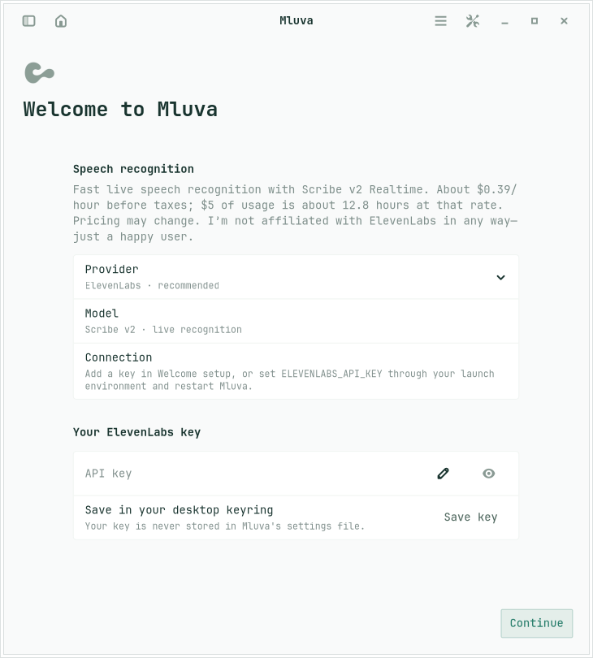
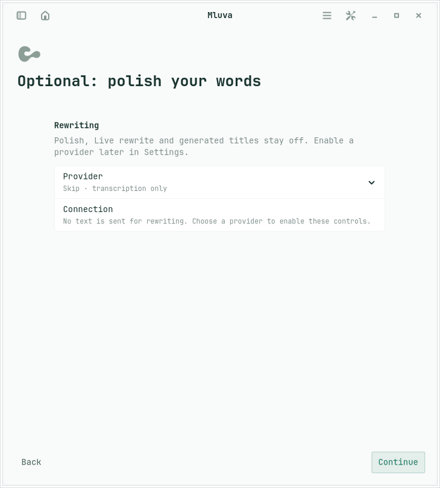
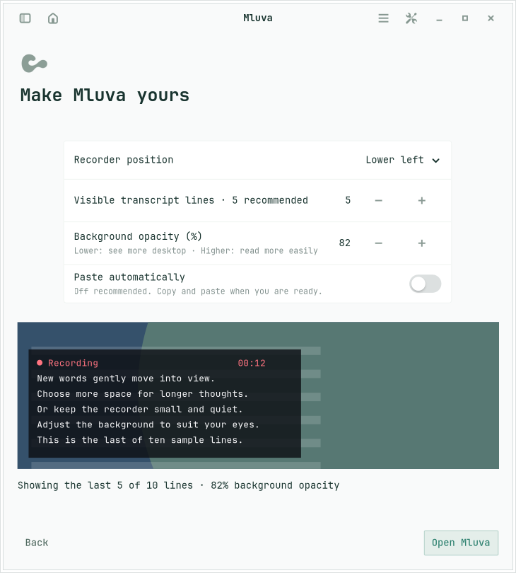

# Self-contained Linux onboarding

First launch has three steps: choose speech recognition, choose optional rewriting, and preview recording appearance. Reopen it through the existing Welcome command. Existing installations retain their preferences; legacy Voxtype configurations reopen setup and migrate to Mluva-managed local recognition without downloading automatically at application launch.

Speech choices are ElevenLabs (recommended), Local, and an advanced OpenAI-compatible endpoint. An ElevenLabs key can be saved to the desktop secret service through `secret-tool`; environment-provided keys retain precedence. No key is written to config.json or command arguments. If the desktop keyring is unavailable, the form offers the environment-based setup route. Saving a key does not verify account credit or make a transcription request.

Selecting a local model begins its verified download. The size slider has five Czech-capable choices; see [model research and limitations](local-speech-models.md). Continue and Apply cannot activate an incomplete model. A download failure offers Retry and never silently changes the provider.

Rewriting choices are Codex, a compatible chat endpoint, and Skip. Skip disables Live rewrite, polish/structure actions, saved-style rewrites and generated titles. The controls remain visible. The disabled provider also rejects programmatic inference calls; this is not merely a visual toggle. Raw transcription, local edits, copying and importing text remain available.

Appearance defaults match the existing recorder: automatic paste off, bottom center, five visible lines and 82% background opacity. Left and right are alternatives. Ten synthetic lines illustrate the last N visible lines, and a synthetic desktop remains visible through the selected opacity. Only the panel background is translucent; text stays opaque. Changes flow through the existing config, D-Bus projection and Omarchy QML widget. The preview is embedded and never moves or captures the user's desktop.

This implementation targets Linux. It does not modify the macOS client. Native X11 offscreen acceptance cannot establish live Hyprland positioning, portal permissions or insertion behavior; those retain their existing implementation and platform limits.

Meeting diarization remains an ElevenLabs feature. With Local or a compatible speech endpoint selected, starting or retrying a Meeting is blocked; the user must explicitly choose ElevenLabs before that upload can run.

## Review screenshots

These use synthetic data on an isolated X11 display.

