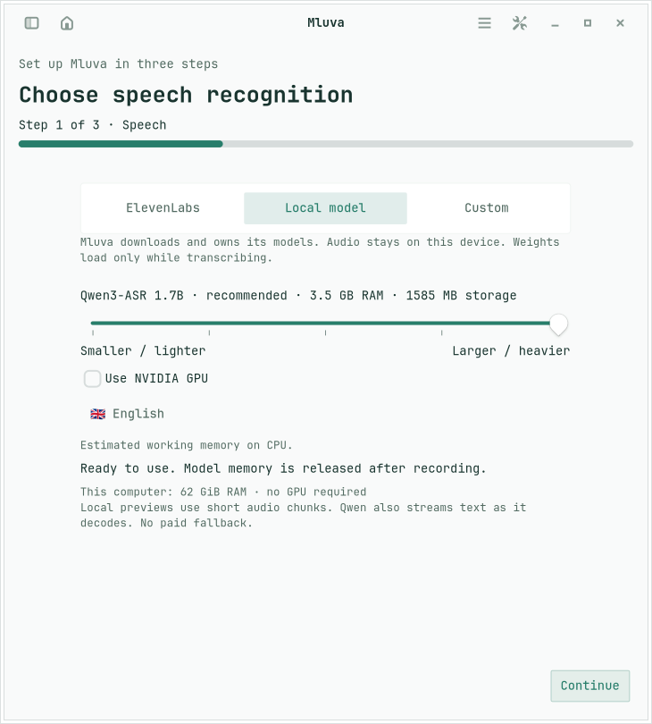
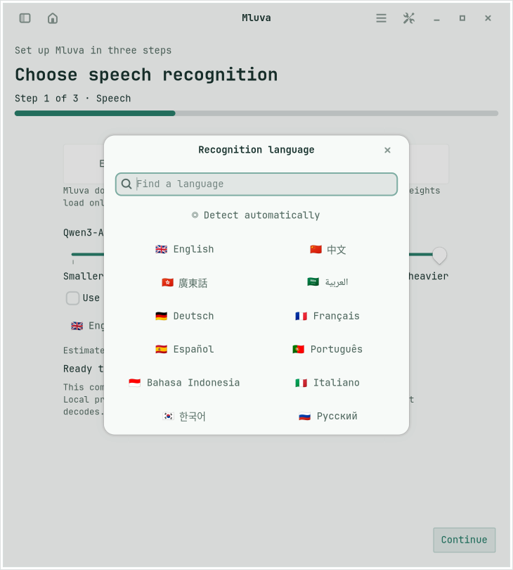
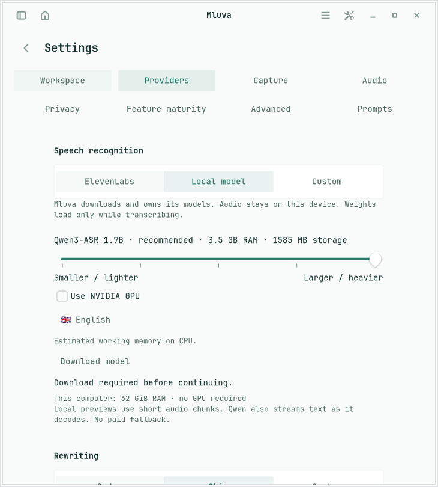

# Self-contained Linux onboarding

First launch shows a progress bar and an explicit step count across three steps: choose speech recognition, choose optional rewriting, and preview recording appearance. Reopen it through the existing Welcome command. Existing installations retain their preferences; legacy Voxtype configurations reopen setup and migrate to Mluva-managed local recognition without downloading automatically at application launch.

Speech choices are ElevenLabs (recommended), Local, and an advanced OpenAI-compatible endpoint. An ElevenLabs key can be saved to the desktop secret service through `secret-tool`; an explicitly saved key takes precedence over an inherited environment key, so entering another account actually changes which account is used. Environment keys remain a fallback. No key is written to config.json or command arguments. If the desktop keyring is unavailable, the form offers the environment-based setup route. Saving a key does not verify account credit or make a transcription request.

Selecting a local model previews its requirements without starting a download. One Download button installs the selected model and, when checked, its optional NVIDIA runtime. The five-stop slider increases in both estimated CPU working RAM and actual model storage; see [model research and limitations](local-speech-models.md). Continue and Apply cannot activate an incomplete model. A download failure offers Retry and never silently changes the provider.

Rewriting choices are Codex (selected by default), a compatible chat endpoint, and Skip. Codex includes an animated, local example of spoken words becoming a polished sentence; the example makes no provider request and respects reduced-motion settings. Skip disables Live rewrite, polish/structure actions, saved-style rewrites and generated titles. The controls remain visible. The disabled provider also rejects programmatic inference calls; this is not merely a visual toggle. Raw transcription, local edits, copying and importing text remain available.

Settings-page navigation, provider and recorder-position choices are always-visible buttons; advanced endpoint controls appear only under Custom. ElevenLabs opens directly to an API-key field and Continue saves it securely before advancing. Codex uses the existing account/model selection without requiring model discovery during setup.

Appearance defaults match the existing recorder: automatic paste off, bottom center, five visible lines and 82% background opacity. Left and right are alternatives. Ten synthetic lines illustrate the last N visible lines, and a synthetic desktop remains visible through the selected opacity. Only the panel background is translucent; text stays opaque. Changes flow through the existing config, D-Bus projection and Omarchy QML widget. The preview mirrors the recorder’s bare 20-pixel breathing-mark/timer header, 500-pixel transcript surface, JetBrains Mono at 14 pixels, and 22-pixel line spacing. It reads the same Omarchy palette and scales to the available space. It is an embedded GTK rendering, not the live Quickshell window; no desktop capture or movement occurs. Short windows scroll the entire recorder step so controls are not squeezed under a pinned preview.

CPU is the default. Qwen3-ASR 1.7B is the default local model, using a compact Q4_0 conversion and an app-owned llama.cpp CPU or NVIDIA Vulkan runtime. Other local models use ONNX with optional CUDA support. Models, runtimes and shader cache share the 5 GB managed download storage guard. The base application environment and temporary installation space are separate. See the model documentation for runtime sizes and measured limitations.

The local language button opens a small searchable modal with flags and native language names. Choices follow the selected model's supported languages. Changing the model does not silently replace a saved language; an incompatible language blocks Continue/Apply until corrected.

This implementation targets Linux. It does not modify the macOS client. Native X11 offscreen acceptance cannot establish live Hyprland positioning, portal permissions or insertion behavior; those retain their existing implementation and platform limits.

Meeting diarization remains an ElevenLabs feature. With Local or a compatible speech endpoint selected, starting or retrying a Meeting is blocked; the user must explicitly choose ElevenLabs before that upload can run.

## Review screenshots

These use synthetic data on an isolated X11 display.

