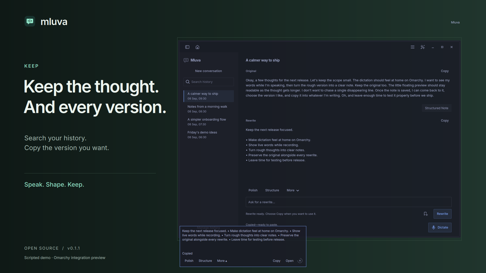

# Mluva promotion assets

**Speak freely. Stay in flow.** Lead with the landscape demo, use the vertical composition for a phone feed, and use the widget close-up when the floating preview is the story. These assets show the v0.1.1 production UI with scripted text, timing and provider output. They are not speech-recognition benchmarks.

[Landscape demo](assets/mluva-omarchy-demo.mp4) · [Vertical demo](assets/mluva-omarchy-vertical.mp4) · [Widget close-up](assets/mluva-widget-closeup.mp4) · [Launch copy](../launch-kit.md) · [Reproduce the capture](../../dev/README.md)

## Videos

| Asset | Format | Use |
| --- | --- | --- |
| [Landscape demo](assets/mluva-omarchy-demo.mp4) | 1920 × 1080, about 32 seconds | Main introduction: speak, shape, keep, then the repository link. |
| [Vertical demo](assets/mluva-omarchy-vertical.mp4) | 1080 × 1920, about 32 seconds | Phone feed, with its own composition and captions. |
| [Widget close-up](assets/mluva-widget-closeup.mp4) | 1000 × 440, 23 seconds | Magnified preview, review, rewrite and Copy. |

The MP4s are silent H.264/yuv420p with fast-start metadata. Keep the scripted-demo disclosure visible when trimming or reposting. Suggested accessibility description: “Mluva's native Linux app and Omarchy widget turn a scripted dictation into a structured note while preserving the original.”

## Screenshots

| Asset | Suggested use and alt text |
| --- | --- |
| [Dark hero](assets/hero-dark.png) | Announcement cover. “Make room for your voice: Mluva's dark workspace with an original and structured rewrite.” |
| [Light hero](assets/hero-light.png) | Light-feed alternative. “Mluva follows a light Omarchy palette while keeping original and rewrite together.” |
| [Workflow](assets/workflow-dark.png) | Plugin overview. “Mluva's saved conversation and floating Omarchy review controls.” |
| [Vertical poster](assets/vertical-poster.png) | Phone-feed cover. “Keep the thought and every version: history, original, rewrite and floating review.” |
| [Dark workspace](assets/workspace-dark.png) | Product detail. “Native GTK workspace with searchable history, original, structured rewrite and Copy actions.” |
| [Light workspace](assets/workspace-light.png) | Theme comparison. “The same Mluva workspace in the light Rose Pine palette.” |
| [Recording widget](assets/widget-recording.png) | Preview detail. “Five wrapped lines of scripted live dictation in the translucent recording widget.” |
| [Review widget](assets/widget-review.png) | Rewrite feature. “Polish, Structure, More, Copy, Open and a dismiss countdown.” |

The PNGs are original captures. Hero images use a composed private desktop; standalone widget PNGs retain transparency. Font, viewport, disclosure, source commit and media hashes are recorded in [manifest.json](assets/manifest.json).

## Distribution and claims

[Mluva v0.1.1](https://github.com/1vecera/Mluva/releases/tag/v0.1.1) and the [installable plugin repository](https://github.com/1vecera/omarchy-mluva) are public. [Marketplace submission #5533](https://github.com/omacom/omarchy-plugin-marketplace/issues/5533) awaits a maintainer's listing decision; the repository being public does not imply marketplace approval.

The ambition is the best dictation workflow for Omarchy: readable words, native theme integration, useful rewrites and recoverable originals. No comparative accuracy or speed lead is claimed. Omarchy integration and rewriting remain Experimental under the [feature matrix](../feature-maturity.md). Recognition uses ElevenLabs cloud processing and the user's API key; optional rewriting and titles use Codex. Automatic insertion is disabled by default.

Screenshots, stage artwork and scripted copy are included under the repository's Apache-2.0 license. Videos contain no music, stock footage, personal recordings or cloned voice. Inter is rendered from the packaged font; font binaries are not distributed with these assets.
