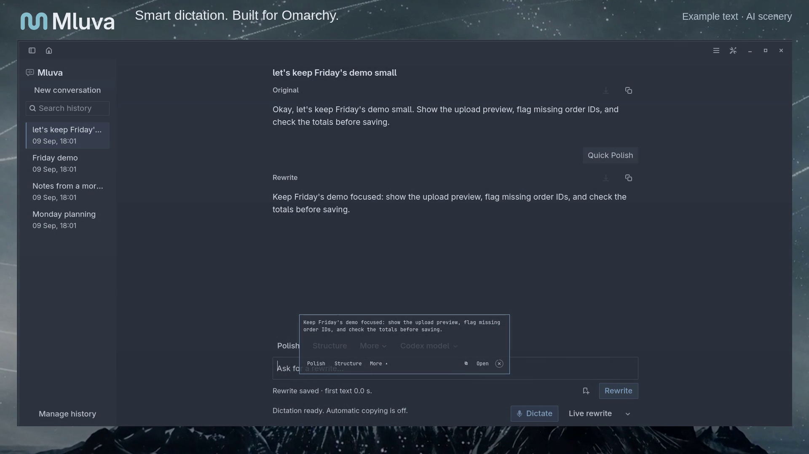

# Earlier 83.6-second product film

This is the historical S27-465 film and its original capture evidence. The [current launch film](README.md) supersedes its positioning and feature presentation. Existing source media and receipts remain available.

[Watch the product film](assets/mluva-product-intro.mp4) · [Poster](assets/mluva-product-poster.png) · [Portable edit plan](assets/mluva-product-intro.plan.json) · [Edit receipt](assets/mluva-product-intro.edit.json) · [Media QA](assets/mluva-product-intro.qa.json) · [Manifest](assets/manifest.json) · [Reproduction](../../dev/README.md)

The **83.6-second**, 1920 × 1080, 30 fps film gives the app the frame, with concise titles above it. The opening holds the new centered Mluva lockup and “Smart dictation. Built for Omarchy.” for two seconds, then moves the identity into the header as the app arrives at 2.2–3.1 seconds. The large hook fades out by 2.28 seconds; the small header hook begins at 2.35 seconds. The six-second opening and 83.6-second timeline are fixed.

Real dictation and Live excerpts retain their original audio, output and speed. The remaining feature walkthroughs exercise production GTK/Quickshell controls with local example text and a scripted rewrite, labeled **Feature walkthrough · example text**. They show interface behavior, not recognition quality, model quality or provider latency. Generated scenery is separate from the crisp vector logo, software text and actual app pixels. No new generation or provider calls were made by this film task.

## Film timeline

| Film seconds | Visible beat | Source and boundary |
| --- | --- | --- |
| 0–6 | Centered identity, then large workspace | Clean H3 Max scenery, software motion and native fixture screenshot. The settled app remains large until the cut. |
| 6–20.8 | Speak. See your words. | Released v0.3.0 JFK run, source 0–14.8 s. Top source label: JFK · Rice University · 1962. |
| 20.8–28 | Polish text you already have | Native new-conversation and Polish actions; local example reply. |
| 28–29 | Scenery transition | Clean H3 Max source, muted. |
| 29–42 | Live rewrite · experimental | Actual unreleased run, source 17–30 s, with the original synthetic narration. |
| 42–45.8 | Keep the original and the finished draft | Actual saved result, source 55.4–59.2 s; **Cut forward · experimental**. |
| 45.8–46.8 | Scenery transition | Clean H3 Max source, muted. |
| 46.8–50.3 | Keep useful controls close | Enlarged completed-note widget; actual Copy callback into the private clipboard. |
| 50.3–53.8 | Open the full note | Cut forward to the settled workspace after the actual Open action. |
| 53.8–60 | Edit and save the full text | Native editor and Save edits action; raw input remains unchanged. |
| 60–65.8 | Find it again | Native history search and row activation. |
| 65.8–71 | Export Markdown or JSON | Both local export buttons produce retained files containing the unchanged original. |
| 71–79.6 | Choose speech and rewriting independently | Actual independent settings selections; no catalog, credential or provider request. |
| 79.6–83.6 | Mluva and the main hook | Software lockup and text over muted clean scenery. |

Each source excerpt plays at 1×. Clip edges have 0.2-second software fades without overlapping timeline segments; real audio uses only declared gain, resampling, AAC encoding and 20 ms edge fades. The JFK source card replaces the initial empty UI visually for 4.667 seconds while all opening words and the measured **0.277938-second audio-stream delay** remain in place. The UI is revealed after its first partial appears, without advancing its pixels against the voice. Only the trailing 2.233 seconds of that continuous source are omitted.

The Live edit crops to the main GTK workspace. The original floating-preview blank interval at source 26.800–27.067 seconds remains in the full source, outside this crop. The explicit cut from source 30 to 55.4 seconds omits Stop/finalization waiting and old panel/editor lifecycle defects. This film does not claim those source-build defects are fixed. The runtime fix is in [draft PR #18](https://github.com/1vecera/Mluva/pull/18); its [separate offline replay report](https://github.com/1vecera/Mluva/blob/c38e6552b63b528421c5246995f0e5e9ad729df4/docs/verification/s27-464-panels.md) measures 15 blank frames before and zero after, with Live editors mapped through held reconciliation. The canonical saved output is unchanged. The [visual review](evidence/polished/visual-review.json) records these decisions and contact sheets.

## Feature footage and claim limits

All six [continuous feature captures](assets/polished/features) use runtime `18004cc98cd73f1b038883e59db6274ee9f0be4b`, a separate Xvfb **:195** session per scenario, private D-Bus/AT-SPI/XDG/clipboard state, and disabled audio, input-target, portal and provider services. The application is 1840 × 920 at (40, 94); its font request is Inter 15, resolved on this host to Liberation Sans. Production runtime files were hashed before and after capture. Each folder retains the exact capture harness, original example text, replies, screenshots, action assertions, uncut MP4 and export receipt. The Markdown/JSON files in the export folder are actual output from the visible buttons.

The fixtures use explicit synthetic text, a local streaming rewrite fixture, and automated callbacks on real controls. The displayed “first text 0.0 s” is that local fixture's status, not a performance claim. Automatic copying/pasting and microphone initialization are disabled; the demonstrated Copy action uses only the isolated clipboard. `capture.json` preserves its original clocks: the before screenshot uses setup time, while action/after events use the clock reset at recorder launch. These are not exact video-frame timestamps or latency measurements. Reproduction uses the archived harness; the current helper adds comments and packaging metadata without changing the captured runtime.

The feature agent's source audit at this same runtime revision bounds the claims: rewriting, Live rewrite, expanded editing, export and conversation search remain Experimental. Live rewrite is opt-in. The floating controls belong to a completed Mluva note; there is no universal toolbar over another app's selected text. “Full note” means the expanded native workspace, with no dedicated full-screen feature. Linux speech routes are ElevenLabs Scribe, installed Voxtype/local Whisper and a compatible audio API; rewrite routes are Codex app-server and a compatible chat API. Their settings are independent. A Codex client is not a local-inference guarantee, and protocol compatibility is not a claim that every vendor, account or model works. See [provider behavior](../providers-and-live-rewrite.md) and the [maturity register](../feature-maturity.md).

Screenshots: [dictation](assets/polished/screenshots/dictation.png), [existing-text polish](assets/polished/screenshots/polish.png), [Live](assets/polished/screenshots/live-rewrite.png), [floating controls](assets/polished/screenshots/floating-controls.png), [expanded editing](assets/polished/screenshots/expanded-editing.png), [history](assets/polished/screenshots/history-search.png), [export](assets/polished/screenshots/export.png), [provider choices](assets/polished/screenshots/provider-choices.png). The poster is film time 3.4 seconds, after the opening app has settled; screenshot times and hashes are in media QA.

## Brand and scenery

The replaceable [brand input](assets/polished/brand/brand.json) points to a flat optical SVG redraw of the coordinator's selected GPT Image 2.5 Sunburst mark, with an outlined Adwaita Sans SemiBold wordmark. The generated raster is a reference; the final film renders the vector lockup. Exact source prompt, request, response and provenance are retained in [brand/source](assets/polished/brand/source); [wordmark provenance](assets/polished/brand/wordmark-provenance.json) records the font, outline process and font license. The earlier built-in image exploration is not used. Mluva remains the draft name.

The [clean H3 Max source](assets/polished/motion/h3-max-clean-background.mp4) is text/UI-free scenery supplied by the coordinator, request `01a086e3-c4b8-7801-aa8e-cb1a81ed9618`. Its complete source, wallpaper reference, prompt, request, response and [provenance](assets/polished/motion/provenance.json) are retained. The film crops it to 16:9, scales it, dims it to 65% and mutes its generated audio. All titles and logos are added in software. The coordinator's latest conservative campaign reservation is $3.40 of $5; actual billing is unavailable. This is provenance, not a billing receipt. The wallpaper and generated material are not claimed as public domain or Apache-2.0.

## Continuous real recordings

| Asset | Identity and content |
| --- | --- |
| [JFK speech workflow](assets/v0.3.0/speech/workflow.mp4) | v0.3.0, `4ce8dc49537da98d8f32f25726f63193774d3b91`; 1920 × 1080, 30 fps, 17.03 seconds. Full recognition/review recording with synchronized source audio. |
| [Live task workflow](assets/unreleased-live/workflow.mp4) | **UNRELEASED**, `cdc00237595f8cfb29e75cd87a980311ea3bcc98`; 1920 × 1080, 30 fps, 59.53 seconds. Full synthetic narration, provisional model input and final reconciliation against committed recognition. |
| [Portrait speech close-up](assets/v0.3.0/speech/vertical.mp4) | 1080 × 1920 editorial crop of the released recording widget, with unchanged timing and original audio. It is the same recognition session. |
| [Portrait poster](assets/v0.3.0/speech-portrait.png) | Native rendering of the real saved v0.3.0 speech result; no additional provider call. |
| [Workspace](assets/workspace-dark.png), [review widget](assets/widget-review.png) | Stable filenames for the real released speech result. The widget PNG retains alpha transparency. |
| [Substantial Live draft](assets/unreleased-live/live-structured.png) | Source frame at 24.0 seconds: actual Task, Intent and Requirements while voiced narration continues. |
| [Partial saved task](assets/v0.3.0/task-saved-partial-desktop.png) | Real v0.3.0 result, explicitly partial because its final update failed. |

These continuous workflow MP4s contain no time cuts or speed changes. Their captured PCM is aligned to the measured first-sample timestamp, encoded to AAC and padded with silence to the screen recording's end. Export receipts preserve the measured offset and its software-timestamp limitation. Captured recognition and provider replies remain unchanged. Crops and the separate product film retain their own disclosures.

## What the Live recording proves

The selected take uses native Codex `gpt-5.6-luna`, low effort, Fast off and the default service tier. Scribe commits remain at 25 seconds. Opt-in Live rewriting may read explicitly provisional recognition; raw history and final reconciliation use committed text. One rewrite runs at a time. The configured later-update thresholds are 160 additional characters and four seconds; the initial gate accepts a 40-character phrase or a short utterance unchanged for four seconds.

All following offsets are relative to the first captured PCM sample. At **11.057 seconds**, a generated but incomplete Intent fragment appears. At **22.730 seconds**, Task, Intent and Requirements are visible while voiced source audio continues. The first Scribe commit arrives at **25.378 seconds**. The expanded update at **34.603 seconds** occurs after the voiced source ends at about 33.742 seconds, while recording continues through padded silence. Stop is at **40.742 seconds**; the canonical final result is painted at **54.911 seconds**. These are observations from one take, not a general latency claim.

Add **0.347045 seconds** to convert those PCM offsets into timestamps in the selected MP4. The saved final reply retains the missing-order-ID flag, preview before saving and totals matching the upload. Owner and deadline remain explicitly unset; the model expresses these as open questions rather than literal `[Missing: ...]` markers. It narrows the spoken general bad-row error criterion to missing-order-ID errors; review the unchanged [source script](assets/sources/task-script.txt), [raw recognition](assets/unreleased-live/recognition.json) and [actual reply](assets/unreleased-live/replies.json).

The raw text is preserved despite recognition artifacts: “Czech crowns” is recognized as “check crowns,” and the padded silence produces an additional sentence about the owner. No wording was corrected in raw history. The original provider events, source hashes, exact runtime identity and final output are retained alongside the video. [Boundary review](assets/unreleased-live/boundary-review.json) records the text and timing checks. [Audio QA](evidence/audio-and-boundary-qa.json) found a 64 ms PipeWire lead-in: voice ends near source +33.678 seconds and captured PCM +33.742 seconds.

The prior [native take](evidence/initial-echo-take/workflow.mp4) is development evidence. Its first provider reply exactly repeated the initial template, so the +8.148-second paint is excluded from meaningful generation; its first substantive paint was +19.120 seconds. A separate [rejected four-second commit experiment](evidence/rejected-four-second-commits/boundary-review.json) lost requirements at speech segment boundaries and hit HTTP 429 on its rewrite request. Neither is presented as the selected performance result.

## Real audio sources and capture boundary

The JFK excerpt is from the September 12, 1962 Rice University address. The [JFK Presidential Library's primary audio catalog](https://www.jfklibrary.org/asset-viewer/archives/jfkwha-127-002) identifies its White House recording as public domain. The downloadable copy's catalog identifies the Library/White House source and Miller Center digital copy. [Provenance](assets/v0.3.0/speech-provenance.json) records both catalogs, the original download and hashes. The selected excerpt is source seconds 527.0–538.5, followed by 0.5 seconds of silence; it is recognized through `scribe_v2_realtime` without a batch fallback.

The task narration was generated once with Fish Audio's free `s2.1-pro-free` default voice. It is synthetic, not a personal recording or an impersonation. The full [original MP3](assets/sources/task-fish.mp3), script and [actual input WAV](assets/sources/task-input.wav) are retained. WAV preparation applies `atempo=0.85` and seven seconds of trailing silence, without removing any spoken content. Provider and media details are in the manifest.

Captures use Xvfb **:193**, separate D-Bus/AT-SPI and XDG state, a private PipeWire graph with no hardware devices, and disabled automatic copy/paste. Xcompmgr supplies real compositing; the theme and wallpaper come from this machine's active Nord installation. This is an isolated X11 render on an Omarchy host, not a live Hyprland desktop recording or a physical-microphone/F9 acceptance test. Cloud recognition and native Codex rewriting use the selected authenticated providers. No credential values are stored in the published evidence.

## Legacy media

The old [H3 interface transition](assets/h3-max/h3-max-transition-raw.mp4) and [generation receipt](assets/h3-max/generation.json) are retained as archive material. Its generated interface/text and the earlier 44.7-second intro contact sheet are excluded from the new film. The previous intro edit remains available in Git history.

All retained v0.1.1 media and its original manifest are under [legacy-v0.1.1](assets/legacy-v0.1.1/manifest.json). Those Fedora-container demonstrations use scripted text and a fake rewrite provider. They are historical UI fixtures, not v0.3.0 recognition footage. The stable `mluva-omarchy-demo.mp4` and `mluva-omarchy-vertical.mp4` filenames now contain the real released JFK recording and its portrait crop. Source licenses and model-generated material are identified separately; public-domain status is claimed only for the historical government speech recording.
