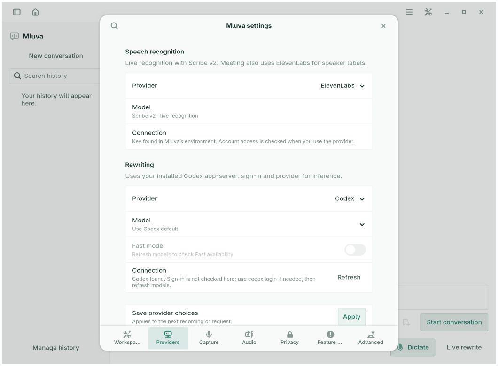

# Choosing speech and rewrite providers

Open **Settings → Providers**. Choose the speech provider and its model, then the rewrite provider and its model. **Apply** saves the page for the next recording or request. Recording and rewriting must be idle before applying changes. Switching providers keeps the other providers’ model choices; opening Settings again reloads the saved configuration. Workspace/Live controls remain on their existing surfaces.

Screenshots use isolated test credentials. [The compact failure state](images/provider-settings-error.png) keeps manual model entry and Apply reachable when discovery is unavailable.

| Task | Provider | Default and setup |
| --- | --- | --- |
| Speech | ElevenLabs | Scribe v2. Set `ELEVENLABS_API_KEY` through the existing secret manager or session service; the supported legacy environment aliases still work. Meeting continues to use ElevenLabs. |
| Speech | Voxtype · local Whisper | Use the existing Voxtype configuration, or select an installed Whisper model. Install Voxtype and run `voxtype setup model` to add models. Use a multilingual model for Czech or other non-English speech. |
| Speech | Compatible API | Use a transcription deployment on a LiteLLM or OpenAI-compatible server. The existing `whisper` alias remains the initial suggestion; replace it with your server’s deployment ID. |
| Rewrite | Codex | Use the existing Codex default, or a specific model from the installed app-server. Authenticate through `codex login`. Fast mode is offered only when the model advertises a Fast tier. |
| Rewrite | Compatible API | Choose a chat deployment on a LiteLLM or OpenAI-compatible server. A model ID is required; Mluva does not guess a cloud model or silently select the first catalog entry. |

Model choices support search. **Enter model ID…** allows an explicit alias when the catalog is unavailable or omits a deployment. A listed model is not proof that the account can use it, and a model absent from a compatible server’s listing may still work. Codex and Voxtype defaults follow their existing configuration; their UI does not invent a fallback model.

**Refresh** is optional. Opening Settings, switching providers and typing an endpoint do not contact a provider. Refresh reads Codex’s `model/list`, Voxtype’s installed Whisper inventory, or the selected compatible endpoint’s `GET /models`. It sends no audio, transcript or rewrite prompt. Speech and rewrite endpoints have separate catalogs. When a compatible server advertises a task mode, the picker filters it; aliases without task metadata remain visible, so choose the appropriate deployment. Older Voxtype versions without the JSON inventory command can still use their configured model or a manually entered name.

A failed, empty or malformed listing leaves the current choice usable and explains the next step. Editing the endpoint/key reference, changing providers, closing the page or reopening Settings invalidates any older in-flight result. Discovery runs off the GTK thread, with bounded requests and child cleanup. It never falls back to another URL or provider.

**Connection details** appears only for compatible APIs. Expand it to edit the API base URL and the **name** of the key environment variable. Include the server’s API prefix, often `/v1`. Speech and rewrite retain independent endpoint/key references. Local servers may not require a key; remote servers generally do. Mluva reports whether a named key exists in its own process environment without showing its value or claiming account access. After changing the launch environment, restart Mluva. URLs reject embedded credentials, query parameters and fragments; remote connections require HTTPS. No credentials or fetched catalogs are saved to `config.json` or diagnostic logs.

**Live speech previews** contains the existing chunk-size option for batch speech providers. Shorter chunks can update sooner and increase requests; the complete recording is recognized again at Stop. Provider settings do not change capture scheduling, raw recognition, clipboard delivery or audio retention.

The compact rewrite picker continues to select models for the current rewrite provider. Switching endpoints clears its old catalog and loading state. Compatible servers have no synthetic “Default” selection that could erase a required deployment alias.

## Troubleshooting

If discovery fails, keep the saved choice or enter the model ID manually. Confirm that the selected endpoint serves the right task and that its key variable is present in Mluva's process. Restart the app after changing credentials in the launch environment.

Provider transport and UI checks are documented in [Contributing](../CONTRIBUTING.md#verification). Compatible API and local Whisper routes remain Experimental; a successful catalog request does not establish recognition quality or account access.
