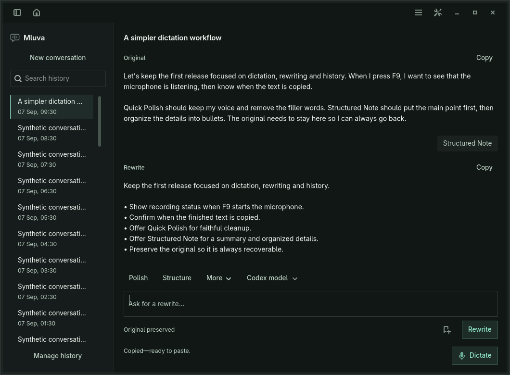
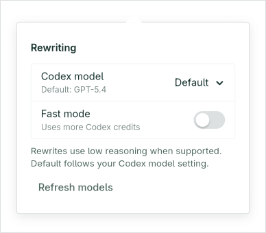

# Rewrite controls and latency evidence

S27-447 adds a catalog-backed rewrite model picker, an optional Fast service tier, and a session-only first-text timing readout. Scrollbar tracks are transparent, with narrow solid thumbs and explicit hover/drag colors instead of inherited outlines and shadows.





## Measurements on Lenovo

On 2026-09-08, Codex CLI 0.153.4 advertised GPT-6-Astra as its default. The local Codex configuration used `xhigh` reasoning and standard speed. An instrumented cold request spent about 0.25 seconds in initialization, model discovery, thread creation and turn submission; its first text arrived after 5.77 seconds. Process reuse would save only a small part of that request and was not introduced.

The checked-in benchmark alternates inherited settings, low reasoning at standard speed, and low reasoning with the advertised Fast tier. Each cell below is the median of three fresh-process requests using the same synthetic sentence. The two models were tested in separate batches. The benchmark includes startup and model discovery, sends no user transcript, and changes no user settings.

| Model | Inherited `xhigh`, standard | Low, standard | Low, Fast |
|---|---:|---:|---:|
| GPT-6-Astra | 6.24 s | 6.43 s | 6.24 s |
| GPT-5.6-Sol | 5.10 s | 5.14 s | 5.60 s |

Sol produced first text about 1.29 seconds earlier than Astra with low reasoning at standard speed in these samples. Low reasoning and Fast did not demonstrate a first-text improvement for this short prompt. All responses preserved the sentence's meaning. This is a small latency sample, not a quality evaluation or a general model recommendation; long conversation replay, service load and network conditions can change the result. Mluva preserves the existing model default and leaves Fast opt-in.

The provider describes Fast as increased model speed with increased credit consumption, not a first-token latency guarantee. See [OpenAI's Codex speed documentation](https://developers.openai.com/codex/speed). Mluva uses the installed [app-server catalog and protocol](https://developers.openai.com/codex/app-server), including the catalog's actual service tier identifier, instead of hard-coding model names or credit multipliers.

Run from `linux/` with an authenticated Codex installation; `--live` explicitly opts into synthetic provider requests and credit usage:

```bash
PYTHONPATH=. uv run --locked python tests/benchmark_rewrite.py --live --runs 3
PYTHONPATH=. uv run --locked python tests/benchmark_rewrite.py --live --runs 3 --model gpt-5.6-sol
```

The benchmark emits per-request JSON and medians. The fixed input is a single sentence about sending release notes on Friday; it does not exercise the maximum conversation context or establish rewrite quality across languages.

## Verification

`make linux-test` checks the complete deterministic suite, feature maturity metadata, Ruff lint and formatting. New protocol tests verify the concrete model, advertised effort and tier sent to `turn/start`, standard-speed reset, old catalog compatibility and bounded settings.

`make linux-conversation-test` includes real GTK picker interactions against a local JSONL subprocess: model/Fast persistence, switching to a model without Fast, save rollback, unavailable-tier rejection, failed catalog discovery and recovery. Existing streaming, cancellation, Incognito and conversation lifecycle checks remain included. The screenshots use synthetic content at 420×520 minimum, 480×640 narrow and 1060×780 wide viewports on isolated Xvfb displays and private D-Bus/AT-SPI sessions. Long notes are checked after the viewport has translated to the latest text, not merely after its adjustment changes.

`make linux-text-target-test` passes against a separate private GTK target on Lenovo; the runner now locates AT-SPI helpers under either `/usr/libexec` or `/usr/lib`. `make linux-shortcut-test` verifies the private portal protocol. These checks do not exercise physical Wayland shortcuts, the user's live clipboard or a live GNOME Shell. GNOME Shell overlay and macOS Swift checks require their respective runtimes, which are unavailable on this Lenovo installation.
