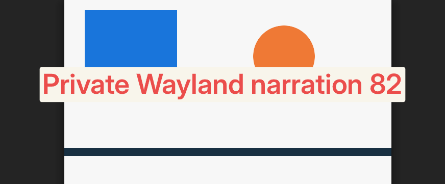

# Current Wayland screenshot verification

6 October 2026: the exact installed Rust 2.1.0 application matches unchanged v1.6.0 for real Omarchy region selection and fresh Tensaku narration on a private Wayland desktop. A saved-conversation flow compares eight states; a continued-recording flow first compares twelve states, then renews them with actual Undo/Redo in fourteen states and clean accessibility startup. Earlier joined image checks used synthetic selection; these checks run the actual installed Omarchy scripts, Hyprpicker, Slurp and Grim. They add evidence only and do not establish complete platform or physical-key parity.

The [compact receipts](receipts.json) preserve identities, all eight compared states, requests and full image hashes. The source is commit `5202477edfe4b5d8bacfa5b2e9fd6eadd9624f7f`; all 91 released Linux modules/resources are byte-verified against its Git archive before and after collection. A fresh private copy of the installed 2.1.0 bundle retains all 520 payload hashes and four links, verified before and after execution. Its app and narration helper are the actual packaged ELFs, not a rebuilt application harness. Both versions launch the same released Tensaku ELF, SHA-256 `79de63b635ec5a711bb250bb4fa7cd2dd69aeeb70dffe735a39c3669f7082831`.

## Observed behavior

The unchanged source configuration/storage APIs prepare only synthetic settings and one saved History item. An external observer launches each normal application, selects that conversation through `mluva-shell latest`, and sends virtual F10 through the private compositor's registered binding. The actual shell bridge asks the application to run `omarchy screenshot region save`. No application callback, recorder factory, screenshot service or editor implementation is replaced.

| State | Compared observation |
| --- | --- |
| Ready | One unchanged History row, no attachment and the original clipboard |
| Selection active | Actual Slurp and Hyprpicker, one private picker directory, no attachment |
| Selected | One image owned by the saved conversation; selector/freeze reaped and temporary directory gone |
| Narrating | Actual editor's chosen text area, native external PCM peer alive, one mode-0600 memory-backed WAV, no upload |
| Annotated | Exactly one speech upload, fresh phrase saved into the PNG, annotation processes/WAV gone |
| Cancel active | A second actual F10 picker; the saved annotation stays intact |
| Cancelled | Escape reaps selector/freeze and removes temporary files; no new image/upload |
| Closed | Normal application Quit, unchanged History/clipboard and saved annotation; external editor remains open as in v1.6.0 |

The private input driver drags from `(80, 140)` to `(720, 500)`, then moves the pointer outside the committed region before capture. Slurp includes the endpoint, yielding 641×361 pixels. The complete selected RGBA bytes equal the corresponding crop of the actual pre-picker frame in each version. Source and native selected PNG bytes also match exactly: 3,832 bytes, SHA-256 `1c12e9970ddc108e92596a705b36f16c2a6c79b49e6bc3ed0b7df145e32fe039`.

The observer accepts the editor's real first-use dialog, uses Add narration, drags a text area and presses Stop narration. Only the external audio/provider boundaries are synthetic: the existing native PCM peer emits 100 ms of fragmented signed 16-bit mono samples at 16 kHz; a private compatible HTTP endpoint returns `Private Wayland narration 82`. Both actual narration helpers upload the identical 3,244-byte WAV and model/language/response-format fields. Independent Tesseract OCR reads the fresh phrase from both exported images.

The complete annotated PNGs match exactly: 9,900 bytes, SHA-256 `a3427fc3715bd26626321de56af4fa5120b9dc0af429e71737c925e9017234b3`; their full RGBA hashes also match. The editor grows the canvas to 872×361 for the chosen text area and default text size in both versions. There is no pixel mask, output crop or native-derived reference.

Every saved-conversation state checks the complete original History row is unchanged and the actual Wayland clipboard retains its sentinel. The screenshot remains owned by that History item with no capture owner or narration offset. Omarchy restores the cursor option's integer value; restoring it makes the option explicitly set, which is retained in raw observations. Normal Quit leaves the independent editor running; only subsequent private-namespace teardown ends it.

## Continued recording, annotation Escape and Stop

The additional [recording receipts](recording-receipts.json) compare the same unchanged release and installed payload. The actual accessible Continue recording button starts the main recorder. Its external PCM process remains alive through real F10 selection, two annotation sessions and the second picker. Each snapshot retains every raw SQLite column and generated identifier in ignored evidence; a separate auditor maps those identifiers consistently and compares all four affected tables.

| State | Compared observation |
| --- | --- |
| Ready | Continued main recorder alive; original History and clipboard intact |
| Selection active | Actual Slurp and Hyprpicker while the main recorder remains alive |
| Selected | One image owned by the current capture, with a frozen narration offset |
| Narrating | Separate annotation helper/PCM process and mode-0600 private WAV; main recording continues |
| Annotation cancelled and saved | Escape reaps annotation helper/audio and erases its WAV without an upload; ordinary Ctrl+S exports no empty box |
| Fresh narrating | New helper/audio process identities and private WAV; the main recorder still runs |
| Annotated | One annotation upload, fresh readable phrase and identical full PNG; annotation resources gone |
| Cancel active | Second real F10 picker with the existing annotation intact |
| Stop recognizing | Public Record/Stop action finalizes the main recorder; its complete speech upload awaits the controlled response |
| Stop waiting for picker | Speech response consumed and staging erased, but processing remains active with one original History row and the image still capture-owned |
| Main completed | Escape reaps selector/freeze; one new immutable recording segment is appended and the annotated image binds to the original conversation |
| Closed | Normal Quit preserves both History rows, combined source, image and clipboard; the independent editor remains open |

Escape followed by Save preserves every selected RGBA byte. Tensaku re-encodes Grim's PNG, changing it from 3,832 to 3,907 bytes; the cancelled export matches between source and native, SHA-256 `014219f3256294cd5c4897eb44d28a4b10eeb17ec8a465a97cdb16574c12b11a`. The fresh annotation matches the saved-conversation image above in both complete PNG and RGBA bytes. Independent OCR again reads `Private Wayland narration 82`.

Distinct signed PCM identifies the main and annotation audio independently. A private external adapter selects the existing native PCM peer by its actual parent process; application, editor and narration launchers are unchanged. The fresh annotation uploads the same WAV as above; the main capture uploads one separate 3,244-byte WAV, SHA-256 `9e6626c6578d40f346ba9b59a506b4aa16a08b20dc3367d9407d1fa3940b1f17`, and receives `Continued main narration 83.`. Cancelled annotation sends neither request. Both peers provide only 100 ms of synthetic samples; this does not test a real microphone or inference quality.

The unchanged application finishes speech recognition before waiting for an open picker. The observer first holds the main HTTP response, then releases it while Slurp/Hyprpicker stay alive. After the speech staging disappears, both applications still report processing and retain the unchanged original History and capture owner. Only picker Escape allows completion. The final combined source is `Private screenshot context 82\n\nContinued main narration 83.`; the original raw/delivered words remain unchanged. Both versions persist the same local fallback title during completion, even with automatic model-generated titles disabled. This expected title write is preserved in the comparison.

Final source evidence is `tmp/wayland-capture-narration/source.X1sHlF/results.json`; native evidence is `tmp/wayland-capture-narration/native.iq6TcE/results.json`. The receipts fingerprint both original results, all twelve raw SQLite snapshots per version, the shared observer/runner, reused pointer driver and independent auditor. `source-identities.log` and `native-identities.log` record terminal success; `audit.json` and `audit.log` record the separate comparison of all source/payload hashes, raw ownership, full images, PCM/WAV, OCR, process routes, interpreter traps and cleanup. Earlier calibration failures remain separate: the status action has no JSON stdout, Save changes PNG encoding, title persistence is legitimate, and batch speech finishes before the picker wait. The first native audio-boundary adapter did not reach the packaged sibling editor; the corrected external parent-based audio routing works without changing package bytes. No production repair was needed.

## Actual Wayland Undo/Redo and accessibility readiness

The later [revision receipts](revisions-receipts.json) preserve a fresh fourteen-state source/native comparison. After the annotated state, actual private Wayland Ctrl+Z followed by ordinary Ctrl+S restores every original selected pixel. Ctrl+Y followed by Ctrl+S restores the complete narrated PNG and OCR phrase. Both actions keep the main recorder alive, preserve the clipboard and capture owner, and produce no extra speech request or annotation process. The second picker/Stop/continuation/Quit sequence then completes normally.

The Undo export is exactly the 3,907-byte cancelled-save PNG above; Redo is exactly the 9,900-byte annotated PNG. Both full PNGs and all RGBA bytes match independently collected source output. Every column in the four affected SQLite tables matches across all fourteen states, with consistent generated identities; the twelve prior normalized database/state observations are unchanged. The new receipt stores only the two added states and references the previous receipt for the shared contract. Earlier receipts and curated images retain their original bytes.

This renewal starts the actual accessibility daemon directly on a unique private abstract address, starts its real registry explicitly, verifies registry Cache readiness and exports the address to both applications and the observer process. It also waits for each actual application/editor PID's Cache.GetItems to return nonempty data before the observer searches accessible controls. Cache and P2P are not disabled. Source/native collector, application, registry and daemon logs contain no accessibility warning, error or abort.

The readiness issue is consistent with GTK's registration ordering: [GTK 4.22.4 creates its cache after the registry Embed reply](https://github.com/GNOME/gtk/blob/442df0886e47cd15ecbdd267e706d08ea517eada/gtk/a11y/gtkatspiroot.c#L752), while early observers can already discover its root. Original diagnostic runs retain transient GetItems failures followed by successful real app/editor cache reads. An intermediate direct-bus attempt also exposed an observer-only error: the new address was set in child environment dictionaries but not in the observer's own environment, so libatspi attempted absent service activation. The corrected observer exports the same verified private address before discovery. These excluded calibration runs remain in ignored evidence; no Mluva, editor, GTK library or live desktop configuration was changed.

Accepted source evidence is `tmp/wayland-editor-revisions/source.xoVQFW/results.json`; native evidence is `tmp/wayland-editor-revisions/native.Qxpftr/results.json`. `source-cache-ready.log` and `native-cache-ready.log` record terminal success. Their fingerprints, actual cache-readiness receipts, all raw database snapshots and shared observer/auditor identities are recorded in the revision receipt. The separate audit rechecks source/payload inventories, exact images/PCM/OCR, all old and new state contracts, raw identifiers and final SQLite, positive interpreter traps and zero accessibility diagnostics.

## Isolation and review

Fresh private HOME/XDG directories, session/accessibility buses, network/PID namespaces, `/run/q` and `/dev/shm` keep this work separate from the visible desktop. Headless Cage contains nested Hyprland with one 1280×900 output, Xwayland disabled and only `/dev/dri/renderD129` exposed. No host input/audio devices, display sockets, microphone, clipboard or provider credentials are used. Virtual keyboard/pointer clients connect only to that verified private compositor.

The native application and its descendants run with absolute Python, Python 3 and uv entry points shadowed by rejecting executables. Three positive invocations first verify those traps; their marker stays at exactly three through app startup, selection, editor narration, Escape and Quit. The reference preparation/observer remains a separate temporary Python process outside that app mount namespace and is neither maintained nor shipped.

The actual Omarchy scripts and system tool hashes are in the receipts. A transparent private `hyprpicker` adapter retains normally discarded diagnostics and execs `/usr/bin/hyprpicker` with the unchanged `-r -z` arguments. No Omarchy source or user configuration is modified. The checked packages are Omarchy 4.0.2, Hyprland 0.56.2, Hyprpicker 0.4.7, Grim/Slurp 1.5.0, imv 5.0.1 and wtype 0.4.

The initial twelve-state continued-recording study positively reads the private registry Cache but retains bounded client-cache `GetItems` warnings in its recording receipts. Its later fourteen-state renewal adds actual app/editor readiness and has clean collected accessibility logs. The eight-state saved-conversation checkpoint retains its earlier diagnostic scope; broader warning-free platform acceptance remains unclaimed.

Initial observer failures are retained under ignored `tmp/current-wayland-screenshots/`: the Lua binding argument is a callback identifier, the virtual pointer needed a persistent seat device, and the nested app mount needed the already private device tree to keep `/dev/null` and the render node usable. Moving the pointer outside the selection removed cursor contamination from the expected frame. Independent review also corrected an assumed SQLite path column and expanded the WAV observation from `/run/q` to include its actual `/dev/shm` staging. These are excluded calibration failures, not Mluva repairs.

Final source evidence is `tmp/current-wayland-screenshots/source.FTaQyO/results.json` and native evidence is `tmp/current-wayland-screenshots/native.kJHjvF/results.json`. Their original sizes/hashes and the shared observer/input-driver fingerprints are in the receipts. `source-memory-audio.log` and `native-memory-audio.log` record successful terminal runs. A separate read-only audit checks the Git/source and installed/copy inventories, raw state equality, direct SQLite ownership, whole PNG/RGBA bytes, pre-picker crop, WAV samples, OCR, real tool identities, positive interpreter traps and normal shutdown. Its successful record is `tmp/current-wayland-screenshots/audit.json`; the audit SHA-256 is `c956a2787aea49a145769d39907763c8b6f9d69b97e5654336ca54a22042d402`.

Only documentation, compact receipts and two synthetic source images are tracked. Production, dependencies, native tests, existing frozen fixtures, installed settings and the released payload are unchanged. No new permanent owner, interpreter helper or bundled observer is added. This evidence-only change does not repeat the unchanged Cargo gates or claim a hosted CI run; CI remains manual `workflow_dispatch`.

## Remaining limits

Virtual keys do not prove physical F10/F9 or Ctrl+Z/Ctrl+Y. These flows do not exercise real microphone/provider behavior, every display scale/theme, GNOME, wider Live/image interleavings, all application diagnostics or performance. The existing [joined image owner](../../../rust/mluva-gtk/tests/fixtures/application-images-evidence.md), [screenshot lifecycle owner](../../../rust/mluva-gtk/tests/fixtures/application-screenshots-evidence.md) and [narration/editor owner](../../../rust/mluva-workflows/tests/fixtures/narration-evidence.md) retain their separately bounded coverage. The [complete Rust acceptance matrix](../../rust-port-parity.md) stays open; this does not authorize or publish another release.
