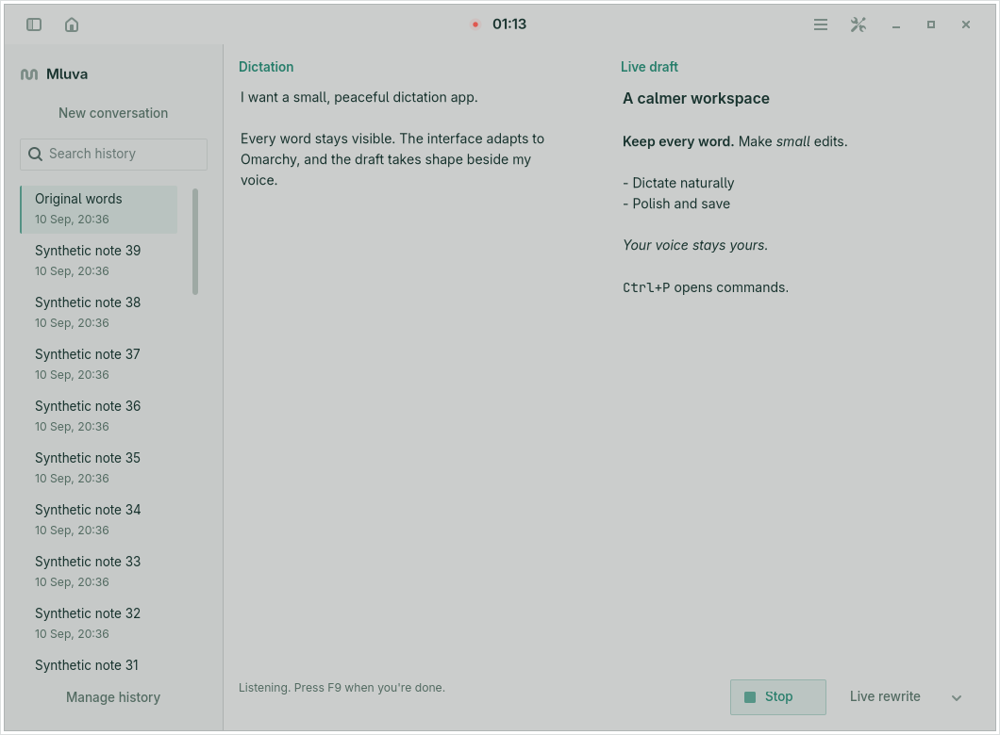

# Movable recorder and title-bar status

Verified on 2026-09-10 against the Linux implementation based on `c3d89d6`. The Omarchy recorder is a normal floating window: drag its status row, focus it and use the existing Super+T binding to tile it, then toggle again to restore its pinned floating state. The GTK recording light and timer occupy the existing title bar above the Live text.

| Boundary | Result |
| --- | --- |
| Complete Linux gate | `make linux-test`: 391 passed; Ruff, formatting and generated-feature consistency passed. |
| Shortcut portal | `make linux-shortcut-test`: registration, binding and lifecycle passed on a private session bus. |
| Native text target | `make linux-text-target-test`: focus capture, Unicode insertion and exact-target confirmation passed between private GTK processes. |
| Shell scripts | `shellcheck linux/*.sh linux/tests/*.sh scripts/*.sh dev/*.sh linux/mluva-shell` passed using `uv run --no-project --with shellcheck-py shellcheck`. |
| Production Quickshell | [Overlay smoke](../../../linux/tests/shell_overlay_smoke.py) passed recording/review lifecycle, five-line preview, smooth scrolling, bounded-prefix wrapping, actions, timed dismissal, hover/focus pauses and owner-loss erasure. |
| Native GTK | [Live layout smoke](../../../linux/tests/live_layout_smoke.py) passed at 1060 × 780 and 480 × 640. It checks header ownership, light teardown during processing/completion, equal panes, stable geometry, scrolling and lossless editing. Recording-light animation, reduced motion and unmapping also passed in the [control smoke](../../../linux/tests/recording_control_smoke.py). |
| Real Hyprland | Native drag moved the recorder by +140, −100 pixels. Tiling resized it from 500 × 127 to 615 × 860; the QML surface settled at that allocation. Returning to floating restored the pin. Configuration reload preserved tiling, and the next recording reopened pinned without taking focus. |
| GNOME extension | `make linux-overlay-test` could not start: this machine lacks `gnome-extensions`. The GNOME extension is unchanged. |

The private Hyprland 0.56.2 session ran beneath a headless Cage compositor, inside a device-isolated namespace with private runtime/session state and no input devices or display-card devices. A render-only GPU node supplied rendering. A virtual Wayland pointer exercised the production `startSystemMove()` path. The test invoked `hl.dsp.window.float({action = 'toggle'})`, the dispatcher used by Omarchy's Super+T binding; it did not establish physical shortcut acceptance. Quickshell was 0.3.1. The synthetic editor and all screenshot text are test fixtures.

The [compositor receipt](hyprland.json) records initial, dragged, tiled, refloated and reopened geometry. [Wide](live-wide.json) and [narrow](live-narrow.json) receipts retain the measured pane and scrollbar allocations. [Source hashes](source-sha256.json) identify the reviewed implementation and primary smoke tests. The compositor exercise was an ad hoc isolated check, separate from the repeatable X11/GTK gates.

The [wide view](live-wide.png) shows the timer above two equal columns. The [narrow view](live-narrow.png) retains the same status in the title bar while stacking the panes. The [tiled recorder](tiled.png) fills its allocated tile; the [floating recorder above a fullscreen editor](above-fullscreen.png) retains its overlay behavior. These images were inspected after rendering settled; the small Hyprland debug-session notice belongs to the private test compositor.

The changed window requires Quickshell 0.3+ and Hyprland's Lua rules (0.55+). Physical F9/Super+T input, multiple monitors, hardware capture and arbitrary real-application delivery remain outside this pass. The current desktop and installed app/plugin were not changed. No hosted CI was dispatched or paid for.
