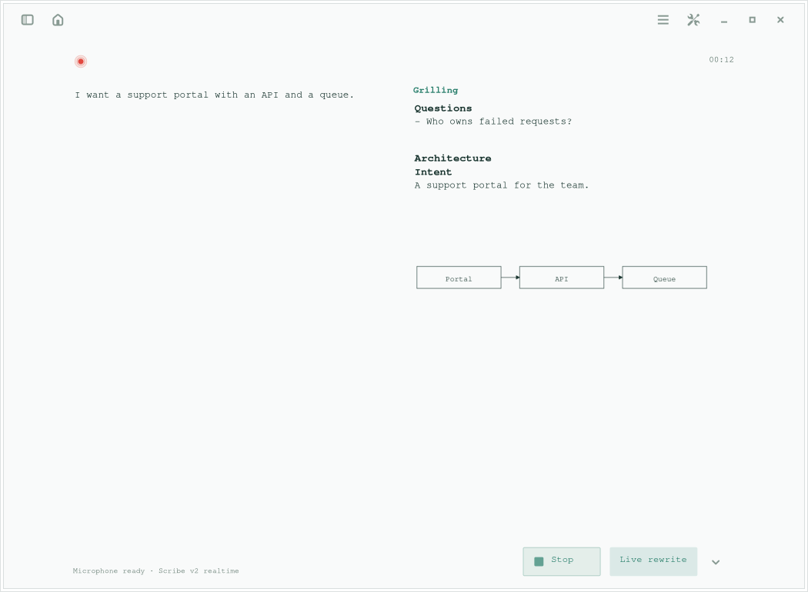
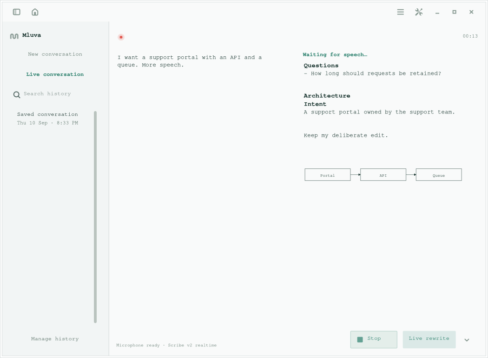
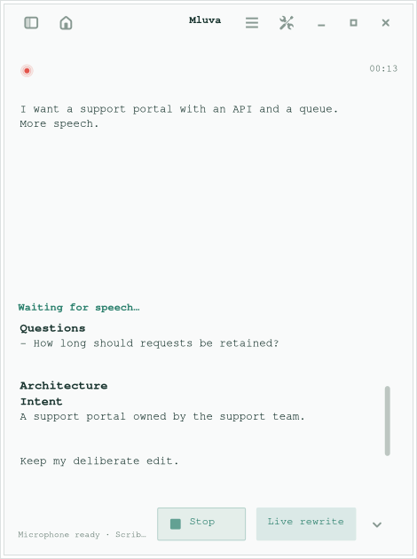
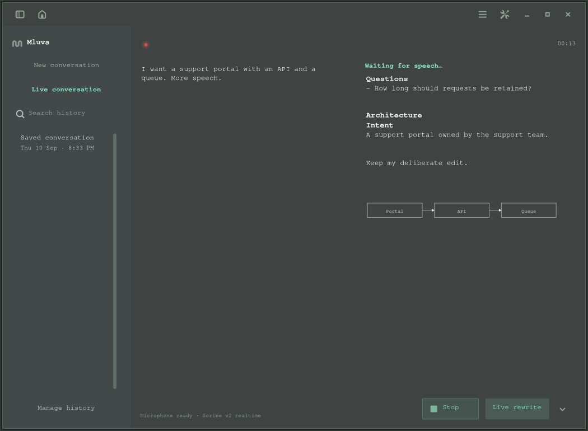
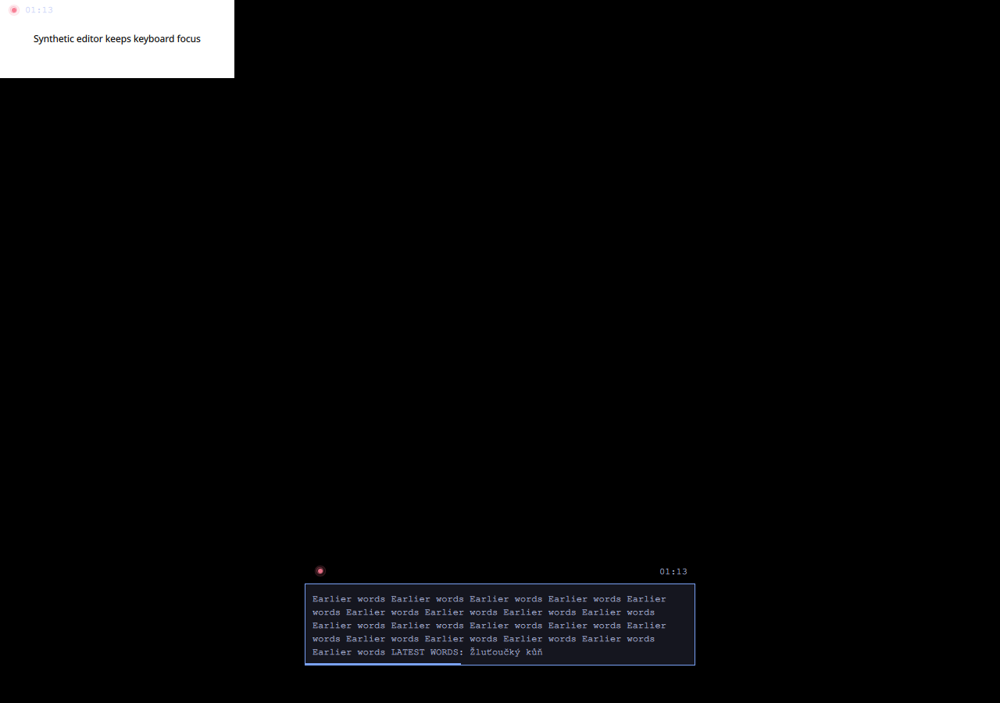

# Fluid dictation workspace verification

Verified on 10 September 2026 in a disposable Fedora Linux container with private X11, D-Bus, accessibility and XDG state. The native GTK application and production Quickshell widget were exercised with synthetic audio/provider and desktop-target boundaries. No microphone, real transcript, host clipboard or visible desktop was used.

## Results

| Check | Result |
| --- | --- |
| `make linux-test` | 419 passed; Ruff lint/format and generated feature checks passed. One existing PyGObject deprecation warning. |
| `make linux-live-rewrite-test` | Passed manual edits, asynchronous results, final reconciliation, cancellation and copy gates. |
| `make linux-command-test` | Passed keyboard invocation, native document actions, stale selection guards and scrolling through the expanded command list. |
| `make linux-shortcut-test` | Passed the private D-Bus portal registration, binding and lifecycle fixture. |
| `make linux-omarchy-test` | Passed production QML/bridge, all three placement presets, unchanged input focus, bare header geometry, full recording pulse, reduced motion and existing review/scroll checks. |
| `fluid_workspace_smoke.py` | Passed mid-recording Live/template changes, manual edits, paused-save/no-copy, rejected late results, live/history navigation, two question snapshots, 69 searchable settings rows, 12-hour dates and wide/narrow layouts. |
| Mermaid rendering | Real local WebKit rendered flowchart and sequence sketches, including a saved/reopened reply. Exact Markdown survived edits and rendering. Invalid/unfinished/directive input stayed recoverable, external image input caused no network request, and process termination restored source. Light/dark rendering was inspected. |
| Staged installation | Installed into repository scratch space; bundled renderer and application module matched source. |
| ShellCheck and `git diff --check` | Passed. |

The Grilling fixture supplies two synthetic model responses to verify question replacement and pinning. It does not establish the quality of questions from a real model. Existing explicit template preferences survive; Grilling becomes the default for omitted/new preferences and Live remains opt-in.

## Reproduce and interpret

Use the contributor targets above and `make linux-fluid-workspace-test` on an isolated Linux environment with WebKitGTK 6.0. The Docker guest used here blocks nested user namespaces, so its synthetic Mermaid check required `WEBKIT_DISABLE_SANDBOX_THIS_IS_DANGEROUS=1` on the final test child. That override is absent from application code and the Make target. Glycin also reported unsandboxed image decoding in this disposable guest. Production WebKit keeps its normal sandbox defaults; browser sandbox operation was not verified here.

X11 evidence does not verify live Hyprland positioning across monitors, floating/tiling integration, physical F9 delivery, microphone capture or provider accounts. These checks did not change the active installation or touch the live desktop. GitHub CI is manually triggered in this repository and was not dispatched.

## Synthetic screenshots

Default workspace with bare recording header, matching monospace text, pinned questions and a local Mermaid sketch:

Sidebar explicitly opened, with Live selected, borderless history search and the 12-hour date format:

Compact layout retains the questions above the independently scrolling architecture notes:

The same content in dark mode:

Production widget on the private display; the separate synthetic editor retains keyboard focus:

