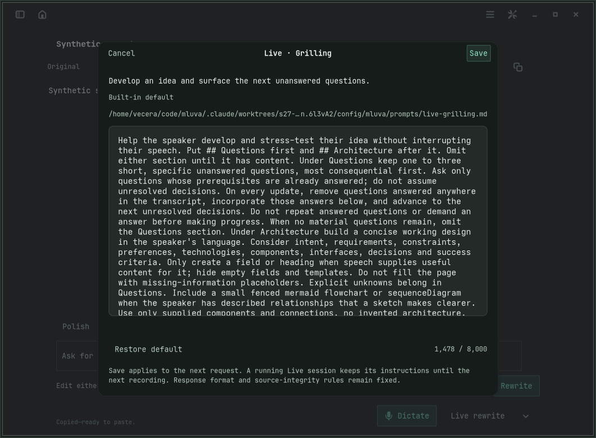
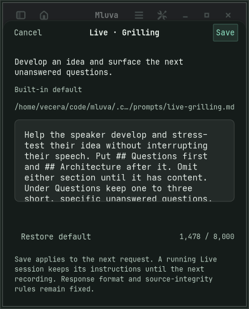
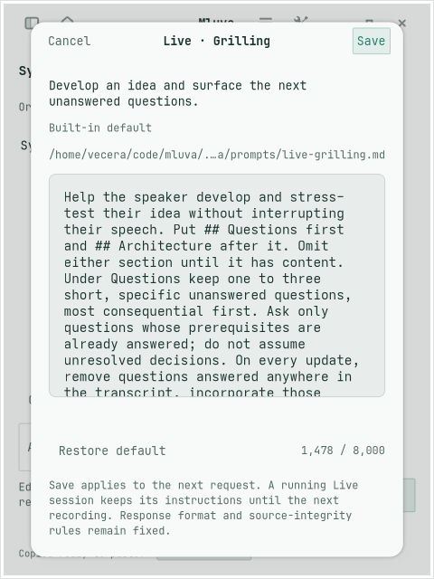
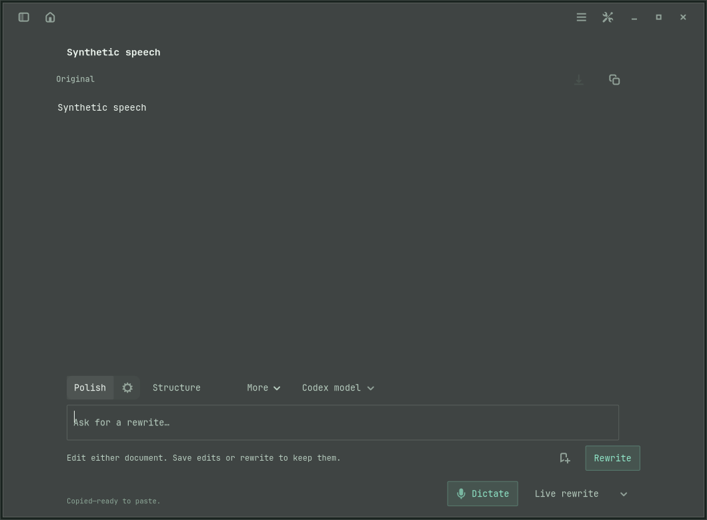
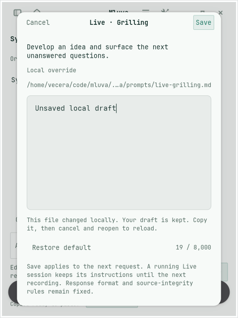

# Prompt editor verification

S27-483 was implemented on Lenovo against remote `main` at `115faa0` (Mluva 1.1.0). The feature is review-only: no merge, install, release or Omarchy mirror changes.

| Check | Result |
| --- | --- |
| `make linux-test` | 435 deterministic tests; Ruff lint and format checks pass. |
| `make linux-prompt-test` | All four isolated scenarios pass, each followed by a fresh-process restart: 420×520 dark, 480×640 light, 1060×780 dark, and 480×640 malformed configuration. |
| Native prompt interactions | Actual private X11 hover and keyboard activation, Ctrl+P deep link, all Live prompt identities, Settings and saved-style links, real discard-dialog buttons, Save/Cancel/reset, invalid text, external-edit conflict, read-only Incognito and editing without a document. |
| Persistence and resolution | Exact multiline/Unicode/braces round trips; every Live template resolves its own override; stable saved-style UUIDs and original legacy text survive; failed writes and conflicts retain prior content. |
| Active recording | Saving leaves the current prompt snapshot, manual draft and revision intact. Live toggles keep the snapshot; the next recording reads changed files. |
| `make linux-live-rewrite-test` | Existing native manual-edit, late-response, final transcript, navigation and copy/save gates pass with synthetic providers. |
| `make linux-command-test` | Existing keyboard command, disabled-action, editor and settings routing checks pass. |
| `make linux-fluid-workspace-test` | Live/history switching, manual edits, answered-question retirement, pinning, late-response rejection, pause/finalization, local flowchart/sequence rendering and exact source round trips pass. Requires the test-only WebKit override described below on this host. |
| `make linux-text-target-test` | Private cross-process AT-SPI focus capture, Unicode insertion and exact target confirmation pass. |
| Image checks | Sixteen PNGs checked for exact declared dimensions, nontrivial size and nonblank pixel data; minimum, light/narrow, wide and conflict layouts inspected. Representative images are below. |
| `make linux-shortcut-test` | Private D-Bus portal registration, binding and lifecycle pass. |
| ShellCheck and `git diff --check` | Pass; ShellCheck supplied through an ephemeral `uv run --with shellcheck-py` environment. |

Final review traced each catalog entry to its request consumer, checked baseline/override precedence and Incognito, reviewed all changed UI entry points, and inspected the minimum-width layout. It fixed dialog parenting, independent edit-button availability, style-list refresh, and reset staging across GTK buffer-change signals. Prompt text has one active override file; original JSON remains a documented recovery baseline rather than a second UI editor.

## Limits and unavailable checks

The ordinary fluid-workspace run hit this host's existing WebKit `dbus-proxy` sandbox startup failure. It passed with `WEBKIT_DISABLE_SANDBOX_THIS_IS_DANGEROUS=1` supplied only to the disposable test invocation, as documented by the earlier [fluid workspace verification](fluid-workspace.md). Application code and Make targets retain production sandbox defaults. Real browser sandbox operation, provider quality, physical global shortcuts and live Wayland behavior are not proven by these checks.

`make linux-overlay-test` was also attempted but cannot run because `gnome-extensions` is absent. It is optional for this unrelated Omarchy/Linux feature under the current contributor guide. The fresh checkout has no Swift package or macOS build scripts; no macOS claim is made. No paid CI or application installation was used.

The private desktop logs include portal/backend warnings because no live Wayland compositor or PipeWire service is exposed. GTK also reports transient small-allocation warnings while the existing main/settings UI adapts to the minimum fixture size; the settled editor screenshots show reachable controls without clipping. X11 runs used isolated displays, D-Bus and XDG state, synthetic text and fake provider/device boundaries. Daniel's live desktop and installed app were untouched.

## Synthetic screenshots

Wide native editor:

Minimum supported 420×520 viewport:

Light theme at 480×640:

Hover reveals an independent settings button:

An external-file conflict keeps the user's draft:

