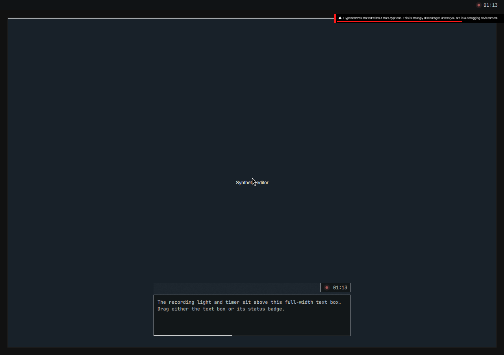

# Floating recorder status and cached plugin update

Verified on 2026-09-10 against the follow-up to PR #25, based on `43d6610`. The recording light and elapsed time share a compact badge above the transcript box. Both the badge and the text box start a native window move. Review buttons retain their own pointer handling. The transcript retains five full-width lines at the initial floating size and grows when tiled.

The installed Omarchy shell reproduced the reported upgrade failure: copying the new QML over the existing plugin and calling `rescanPlugins` left the old component cached. Moving the manual plugin to a fresh source directory and rescanning loaded the native floating recorder. The [upgrade receipt](upgrade.json) records this result, including preserved editor geometry and focus. The test ran the installed shell and plugin loader, with private configuration, a synthetic status publisher and isolated system services.

The [Hyprland receipt](hyprland.json) records separate native drags from the status badge and text box, each moving the window by +140, −100 logical pixels. It also covers tiling, restored floating pinning, configuration reload, reopening without taking focus, remaining visible above a fullscreen editor, and a real pointer click on Copy that activates the button without moving the window. The test uses the exact dispatcher behind Omarchy’s Super+T binding; it does not claim physical keyboard acceptance.

The production [QML smoke](../../../linux/tests/shell_overlay_smoke.py) passed recording/review lifecycle, visible transcript rendering, status geometry above the box, full-width lines, scrolling, actions, countdown and owner-loss checks. Its geometry assertions use a shared coordinate space and verify effective visibility, so hidden content cannot pass from text properties alone. `make linux-test` passed all 408 tests, Ruff, formatting and generated consistency. The private shortcut-portal and native text-target checks and repository shell checks also passed.

The compositor checks used Hyprland 0.56.2 and Quickshell 0.3.1 beneath a headless Cage instance, with private D-Bus/XDG state, no physical input or display-card devices, a render-only GPU node and a virtual Wayland pointer. These were ad hoc compositor exercises alongside the repeatable repository smoke tests. All displayed text is synthetic; the small Hyprland debug-session notice belongs to that private environment. Hardware capture, speech providers, multiple monitors and physical shortcuts were not exercised. [Source hashes](source-sha256.json) identify the implementation and repeatable QML fixture.
