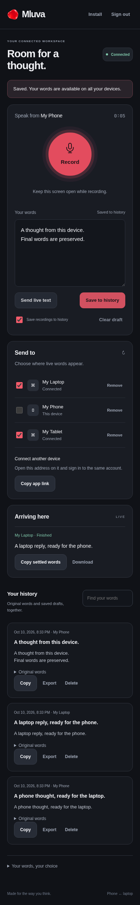
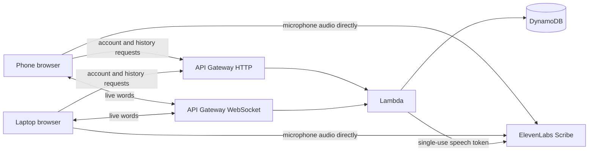

# Mluva Everywhere

A separate, installable web companion for speaking on a phone and using the words on any laptop, or the other way around. Sign in with the same account, name each device, choose receivers, and Record. Incoming settled words have explicit Copy and Download actions. Original recognition and edited text stay together in cloud history. The existing [native phone recorder](../docs/browser-recorder.md) remains available for streaming into the desktop widget with its selected providers and local History.

**Status: prepared product candidate, not deployed.** Three-device browser acceptance uses actual Chromium/Web Audio with synthetic microphone and speech peers. Real Cognito sign-up, AWS fan-out, physical iPhone/Android behavior and paid Scribe latency still need an authorized hosted acceptance run. Cloud speech defaults off in the infrastructure until that gate is accepted. The hosted browser workspace is independent of the native SQLite History and clipboard; sign-in does not silently migrate local desktop conversations.



## Try it locally

From this directory, with Node.js 24 or newer:

```sh
npm ci --ignore-scripts
npm run dev
```

Open `http://127.0.0.1:8788`. The clearly labeled local test workspace uses an in-memory account and synthetic speech service; closing the preview discards its server history. Open another browser profile to connect a second device. Recording manually still asks for that browser’s microphone permission; automated tests substitute a synthetic microphone. Local preview never sends audio to ElevenLabs or creates AWS resources.

## Product behavior

- Email sign-up, verification, password recovery and sign-in use Cognito’s managed login and authorization code flow with PKCE. Tokens stay in session storage; provider keys stay on the backend.
- Up to 12 named active devices can belong to an account. Each connected tab gets a single-use ticket that expires after 60 seconds. Live connections recheck device registration and account-token expiry on every message; Remove disconnects the registered device. Signing in again can register a new device, so use account credential controls for a lost or compromised device.
- Phones, tablets and laptops can record and receive. Selected online receivers see ordered partial and settled words. Partial recognition remains speculative; only settled words can be copied. Receivers never overwrite a clipboard automatically.
- Live delivery is best effort. Missing updates are reported; a sender saves the complete settled draft to history for recovery. Disconnection does not interrupt a healthy direct speech connection. The sender can keep recording locally and retry cloud saving when reconnected. Receivers are limited to six visible live sessions to bound memory.
- Saving is idempotent by recording ID, preserves original text separately, and supports a changed draft as a new saved version. History loads 30 entries per page. Search covers loaded pages. Per-entry Markdown export includes both draft and original. Delete removes live history on every device and leaves a content-free retry tombstone so delayed saves cannot restore deleted text.
- Unfinished drafts are saved to account-scoped IndexedDB, including committed segments during recording. Stopped compressed audio is retained locally when finalization or saving fails. Clear removes that recovery. Audio is never uploaded into cloud history. Turning off history disables persistent recovery for new work; Copy/Download remains available in memory. Manual Save is an explicit override.
- Recording uses 50 ms PCM frames and ordered manual speech commits every five seconds, stops at two hours or the local audio bound, and finalizes the last audio before cloud saving. Text is bounded to 90 KB per original or draft, with recording stopped near that limit. Keep the screen open and unlocked; browser/OS interruption can lose active audio that has not reached Stop. Wake lock is requested where supported, without promising background recording.
- Install uses the browser prompt when available, with Safari/Chrome instructions otherwise. The service worker is network-only and stores no history, audio or tokens. Launch needs network access; unfinished drafts can be recovered after sign-in when the app reconnects.

## AWS architecture

Application compute consists solely of short-lived AWS Lambda invocations. Cognito handles identity, API Gateway handles HTTP and WebSocket connections, DynamoDB holds per-account history and connection metadata, and a private S3 bucket serves static files through CloudFront. There is no EC2/ECS server, container worker, streaming Lambda invocation or server audio relay.



HTTP JWT authorization validates Cognito access tokens. A WebSocket connect exchanges a short-lived one-use ticket; raw account tokens are never placed in its URL. API Gateway calls the connect integration before accepting the socket; every subsequent action loads its account, device and authorization deadline again. Device/session keys and history queries are scoped by authenticated account, not a user-supplied owner. Transactions protect admission, sequence changes and history receipts. Provider tokens are limited to five creations per account per minute. WebSocket text frames remain below API Gateway’s 32 KB limit; the browser reconnects after idle/network/duration closures.

The API responds without caches and never logs request bodies, transcripts, connection tickets or credentials. Static assets have CSP, no-referrer, frame denial and microphone-only permission policies. DynamoDB encryption and point-in-time recovery are enabled; deleted text may remain in operational backups for up to 35 days. The stack retains identity, history and static storage on deletion. A rollback of code does not remove saved data or provider processing already performed.

## Prepare and deploy

Deployment creates billable resources and publishes the static app. This branch only prepares those resources. Review the exact stack, AWS account/region, audience, provider budget and static files before authorizing deployment. There is no automatic push/PR deployment. The repository’s native CI is manual.

Use AWS SAM CLI and a uniquely named stack in the intended account/region. Defaults below keep cloud speech off. SAM’s Node.js builder expects a compatible Node runtime and installs the locked server dependencies.

```sh
sam validate --lint --template-file template.yaml
sam build --template-file template.yaml
```

After deployment is explicitly authorized, run `sam deploy --guided` from this directory, choose the account/region and unique `LoginDomainPrefix`, and leave `SpeechEnabled=false`. Cognito callback/logout addresses and API CORS use the generated HTTPS CloudFront address. No custom domain, access widening, invitation or provider secret is created automatically.

Download stack outputs locally and prepare static assets:

```sh
aws cloudformation describe-stacks --stack-name mluva-everywhere --region eu-central-1 > ../tmp/mluva-stack-outputs.json
node scripts/configure.mjs ../tmp/mluva-stack-outputs.json ../tmp/mluva-prepared-site
```

Review `../tmp/mluva-prepared-site` and the actual S3 bucket/CloudFront audience before upload. A separately authorized `aws s3 sync` publishes that directory to the stack’s `SiteBucket`. The bucket itself is private; the CloudFront app shell is public, while all accounts, live text and history require sign-in. Configure allows no production `dev` login or synthetic speech endpoint.

Cloud speech additionally requires an existing Secrets Manager secret containing only the ElevenLabs API key, its ARN as `SpeechSecretArn`, a provider budget, representative latency acceptance and authorization to update `SpeechEnabled=true`. Do not paste keys into source files, static configuration, shell arguments or CloudFormation parameters. Creating a speech token starts no transcription until the browser connects; transcription is billed by the provider. Default throttles and reserved concurrency are protective starting limits, not a capacity or cost guarantee. Private speech testing can use an authorized test stack; public activation follows measured acceptance.

No hosted deployment, real email delivery, account invitation, static upload or paid transcription has been performed by this change.

## Latency acceptance

The default audio path is phone/laptop → Scribe directly. Lambda issues a token before capture starts; no application server adds a steady-state audio hop. This is a plausible architecture for low additional delay, **not a measurement proving p95 below 100 ms**. Recognition latency, startup/token latency and cross-device text fan-out are separate quantities.

Download connection diagnostics in the privacy section to inspect content-free samples of committed-provider-event → next animation frame and live update acknowledgment round-trip time. Neither metric is a one-way cross-device latency measurement. Diagnostics contain no words, audio, tokens or owner/device IDs. Local synthetic results must not be reported as hosted Scribe speed.

For the gate, use the same paced synthetic audio and provider settings on a direct baseline and the hosted app with the same five-second manual commit cadence, measure at least 30 warm sessions on representative Czech phone/laptop networks, and compare p50/p95 first-partial and committed-text latency. Include cold token/startup separately. Require p95 of paired extra steady-state speech delay below 100 ms, no missing final words and complete recovery from interrupted sessions. Also measure device-to-device delivery; report it separately, with clock synchronization if using one-way timestamps. Enable speech only after that evidence is reviewed. A failing result leaves speech disabled and avoids adding a server relay.

## Verify

```sh
npm run check
npm test
bash scripts/test-browser.sh
```

Browser acceptance needs Chromium, bubblewrap, Xvfb and D-Bus. The script uses a private display/buses, network/PID/device namespaces, software rendering, fresh browser profiles and synthetic microphone data. Set `MLUVA_OFFSCREEN_RUNNER` if the installed helper is elsewhere; it otherwise falls back to the repository runner. Evidence lives in `../tmp/hosted-evidence`. The test server is never bundled into Lambda.

[Verification evidence](../docs/verification/hosted-companion/README.md) records the observed results and remaining hosted/mobile limits. [Task spec](../tasks/phone-product.md) defines the product target.

Implementation references: [Cognito PKCE](https://docs.aws.amazon.com/cognito/latest/developerguide/using-pkce-in-authorization-code.html), [API Gateway WebSocket limits](https://docs.aws.amazon.com/apigateway/latest/developerguide/apigateway-execution-service-websocket-limits-table.html), [Lambda Node runtimes](https://docs.aws.amazon.com/lambda/latest/dg/lambda-nodejs.html), [Scribe single-use tokens](https://elevenlabs.io/docs/api-reference/tokens/create), and [Scribe realtime events](https://elevenlabs.io/docs/eleven-api/guides/how-to/speech-to-text/realtime/event-reference).
